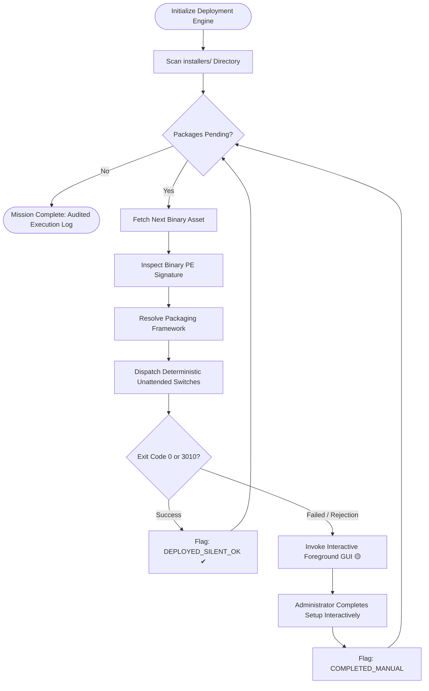

<div align="center">

# Install or Not 2.0
### Enterprise Windows Post-Provisioning & Silent Deployment Suite

[](https://github.com/Uwedwa/install-or-not)
[](https://www.python.org/)
[](LICENSE)
[](https://github.com/Uwedwa/install-or-not/releases)

<p align="center">
  <b><a href="README.md">English</a></b> • <b><a href="README_TR.md">Türkçe</a></b>
</p>

<p align="center">
  A high-performance, resilient post-format orchestration engine designed for IT administrators, system engineers, and enterprise workstations. Automatically inspects binary PE headers, resolves installer packaging engines, and executes unattended, silent software deployments with zero parameter conflicts.
</p>

</div>

---

## 📋 Table of Contents

- [Executive Summary](#-executive-summary)
- [Key Architectural Features](#-key-architectural-features)
- [Installer Engine Identification Matrix](#-installer-engine-identification-matrix)
- [Curated Deployment Profiles](#-curated-deployment-profiles)
- [Execution & Workflow Architecture](#-execution--workflow-architecture)
- [Deployment Modes](#-deployment-modes)
  - [Mode 1: Standalone Portable Binary (Recommended)](#mode-1-standalone-portable-binary-recommended)
  - [Mode 2: Source Execution via Python](#mode-2-source-execution-via-python)
- [Compiling Standalone Binary](#-compiling-standalone-binary)
- [System Architecture & Codebase](#-system-architecture--codebase)
- [System Requirements & Security](#-system-requirements--security)
- [License & Enterprise Compliance](#-license--enterprise-compliance)

---

## 💼 Executive Summary

Standardizing and configuring fresh Windows environments across multiple workstations is traditionally a labor-intensive, error-prone task. Technicians frequently grapple with fragmented vendor installers, inconsistent silent switch standards, bundled third-party bloatware, and unexpected setup failures.

**Install or Not 2.0** eliminates deployment bottlenecks by offering an automated, non-invasive provisioning pipeline:
* **Deep Binary Inspection:** Automatically parses Portable Executable (PE) headers to determine the exact packaging framework (Inno Setup, NSIS, WiX / Burn, InstallShield, 7-Zip SFX, or Microsoft Windows Installer).
* **Deterministic Parameter Dispatch:** Feeds vendor-tested unattended execution arguments specific to the detected framework, avoiding argument collisions and syntax aborts.
* **Intelligent Interactive Fallback:** If an installer explicitly rejects silent automation or demands proprietary license inputs, the engine seamlessly invokes the native graphical installer in the foreground. Technicians can complete manual steps without terminating or blocking the remaining deployment queue.
* **Integrated Package Manager:** Supports direct provisioning through Microsoft Windows Package Manager (`winget`) with curated workstation profiles.

---

## ⚡ Key Architectural Features

| Capability | Legacy Approach | Install or Not 2.0 (Enterprise Engine) |
| :--- | :--- | :--- |
| **Engine Detection** | Filename guesswork or blind execution | **Zero-dependency byte-level PE header fingerprinting** |
| **Parameter Handling** | Concurrently passing conflicting switches (`/S /q /silent`) | **Engine-specific, deterministic argument resolution** |
| **User Interface** | Unresponsive command consoles | **Modern dark HUD with real-time progress & status badges** |
| **Failure Recovery** | Process freeze or abrupt script exit | **Asynchronous execution with graceful interactive GUI fallback** |
| **Cloud Repository** | Manual web navigation and asset downloads | **Curated Winget loadout profiles for 1-click batch installation** |
| **Task Concurrency** | Blocks caller thread during long setups | **Multi-threaded background queue manager with non-blocking UI** |
| **Distribution** | Requires target Python environment | **Single-executable standalone distribution (`.exe`)** |

---

## 🧠 Installer Engine Identification Matrix

Installers built on different frameworks crash or exhibit unpredictable behavior when presented with unrecognized command-line switches. **Install or Not 2.0** reads file signatures across both leading and trailing byte streams:

| Packaging Engine | Binary Signatures & Byte Patterns | Deterministic Unattended Arguments |
| :--- | :--- | :--- |
| **Inno Setup** | `Inno Setup Setup Data`, `InnoSetup` | `/VERYSILENT /NORESTART /SUPPRESSMSGBOXES /SP-` |
| **NSIS (Nullsoft)** | `NullsoftInst`, `Nullsoft.NSIS` | `/S` *(Strictly uppercase parameter)* |
| **WiX / Burn** | `WixBurn`, `WixAttachedContainer` | `/quiet /norestart` |
| **InstallShield** | `InstallShield`, `ISSetup.dll` | `/s /v"/qn /norestart"` |
| **7-Zip SFX** | `7z\xbc\xaf\x27\x1c`, `7zS.sfx` | `-y` |
| **Advanced Installer** | `Advanced Installer`, `Caphyon` | `/exenoui /qn /norestart` |
| **MSI Package** | Windows Installer Compound Container | `msiexec /i <file> /qn /norestart /passive` |
| **Generic / Unknown** | Unidentified Portable Executable (PE) | Incremental probe with immediate fallback to interactive GUI |

---

## 🎯 Curated Deployment Profiles

In addition to local installer staging, the integrated **Winget Armory** offers curated software kits tailored for professional environments:

```
├── 💻 Developer Workstation
│   ├── Git for Windows
│   ├── Microsoft Visual Studio Code
│   ├── Windows Terminal
│   ├── Python 3.12 Runtime
│   ├── Node.js LTS
│   └── Docker Desktop
│
├── 🏢 Enterprise Productivity & Office
│   ├── Brave Browser
│   ├── VLC Media Player
│   ├── Notepad++
│   ├── 7-Zip Archive Manager
│   ├── ShareX Screen Capture
│   └── Microsoft PowerToys
│
└── 🛠️ System Runtimes & Dependencies
    ├── Microsoft Visual C++ 2015-2022 Redistributable (x86 & x64)
    ├── Microsoft DirectX End-User Runtime
    └── Microsoft .NET Desktop Runtime
```

---

## 🔄 Execution & Workflow Architecture



---

## 🚀 Deployment Modes

### Mode 1: Standalone Portable Binary (Recommended)

> **Ideal for:** IT field technicians, automated USB provisioning kits, and offline workstations where Python is not pre-installed.

1. **Obtain Asset:** Download the latest `Install_or_Not.exe` binary from [**GitHub Releases**](https://github.com/Uwedwa/install-or-not/releases).
2. **Create Staging Folder:** In the directory where `Install_or_Not.exe` resides, create a folder named `installers`:
   ```cmd
   mkdir installers
   ```
3. **Stage Packages:** Place your `.exe` and `.msi` installers inside the `installers/` directory.
4. **Execute:** Right-click `Install_or_Not.exe` and select **Run as Administrator**.
5. **Orchestrate:** The application will index staged binaries, display their detected engines, and initiate unattended deployment with real-time feedback.

---

### Mode 2: Source Execution via Python

> **Ideal for:** Software engineers, CI/CD runners, and teams looking to extend or customize the core framework.

#### System Requirements
* **Operating System:** Windows 10 / 11 / Server 2019+
* **Python Runtime:** Python 3.10 or higher
* **Privileges:** Elevated (Administrator) shell recommended

#### Installation & Launch

```powershell
# 1. Clone the repository
git clone https://github.com/Uwedwa/install-or-not.git
cd install-or-not

# 2. Install required dependencies
pip install -r requirements.txt

# 3. Create the staging directory for installers
mkdir installers

# 4. Launch the application
python install_or_not.py
```

---

## 📦 Compiling Standalone Binary

To produce an isolated, single-file Windows executable directly from source:

```powershell
# 1. Install PyInstaller build framework
pip install pyinstaller pillow

# 2. Compile into an optimized, windowed single-file executable
python -m PyInstaller --noconfirm --onefile --windowed `
  --name "Install_or_Not" `
  --collect-all core `
  install_or_not.py
```

The compiled binary will be placed inside the `dist/Install_or_Not.exe` directory ready for enterprise distribution.

---

## 📁 System Architecture & Codebase

```
install-or-not/
├── install_or_not.py          # Primary GUI Controller & HUD Driver
├── core/
│   ├── __init__.py            # Core package descriptor
│   ├── detector.py            # Zero-dependency binary PE parser & signature resolver
│   ├── executor.py            # Threaded process runner & interactive fallback dispatcher
│   └── presets.py             # Winget catalog manager & loadout configurations
├── installers/                # Default staging zone for staged deployment packages
├── requirements.txt           # Minimal runtime dependencies (Pillow)
├── LICENSE                    # GNU General Public License v3.0
├── README.md                  # Master documentation (English)
└── README_TR.md               # Kurumsal kullanım kılavuzu (Türkçe)
```

---

## 🔒 System Requirements & Security

* **Access Control:** Installing software system-wide requires local administrative privileges (`Run as Administrator`). If executed in standard user mode, installers requiring machine-level registry writes will request elevated UAC elevation.
* **Integrity:** Binary signature analysis operates via read-only file streams and does not modify the source packages in any way.
* **Network Independence:** Local installer deployment is fully functional in air-gapped and isolated network environments without internet connectivity. Internet access is only utilized when invoking the optional Microsoft Winget Armory module.

---

## 📄 License & Enterprise Compliance

This project is licensed under the terms of the **GNU General Public License v3.0**. Review the [LICENSE](LICENSE) file for complete licensing terms, rights, and restrictions.

<div align="center">
  <sub>Enterprise Software Deployment Engine • Developed by <a href="https://github.com/Uwedwa">uwedwa</a></sub>
</div>
