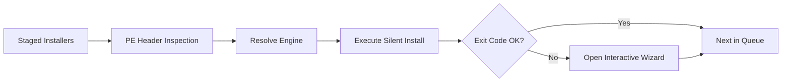

# Install or Not

> Intelligent, unattended post-installation & software deployment orchestrator for Windows.

[](https://github.com/Uwedwa/install-or-not)
[](https://www.python.org/)
[](LICENSE)
[](https://github.com/Uwedwa/install-or-not/releases)

<p align="left">
  <b><a href="README.md">English</a></b> • <b><a href="README_TR.md">Türkçe</a></b>
</p>

---

## Overview

**Install or Not** is a lightweight Windows utility designed to automate software installations after formatting or setting up a new PC.

Instead of manually clicking through repetitive installation wizards or guessing silent command-line switches, **Install or Not** automatically inspects the binary headers (PE headers) of your `.exe` and `.msi` files, identifies their packaging engine, and executes them with the correct unattended parameters.

If an installer does not support silent deployment or returns an error, the application automatically launches the standard interactive installer in the foreground—allowing you to complete that setup manually without breaking the rest of your installation queue.

---

## Key Features

- **Binary PE Header Inspection:** Automatically identifies installer types (Inno Setup, NSIS, WiX / Burn, InstallShield, 7-Zip SFX, Advanced Installer, and MSI) by analyzing file byte signatures without external dependencies.
- **Accurate Silent Switches:** Applies engine-specific parameters (e.g. `/VERYSILENT` for Inno, `/S` for NSIS, `/quiet` for WiX) to eliminate parameter syntax errors.
- **Interactive Fallback:** If silent installation fails or requires manual input, gracefully invokes the native setup wizard in the foreground.
- **Driver Vault (Backup & Restore):** Export installed third-party OEM device drivers (GPU, Wi-Fi, Audio, Chipset) before formatting, and batch-restore them on a fresh system with one click.
- **Winget Integration:** Built-in curated software bundles (Developer Tools, Productivity Essentials, Gaming & Media) available for 1-click deployment via Windows Package Manager.
- **Modern Interface:** Dark-themed UI with real-time status badges (`QUEUED`, `DEPLOYING`, `DONE`, `MANUAL`), progress tracking, and live stdout logging.
- **Standalone & Portable:** Available as a single standalone executable (`Install_or_Not.exe`) that requires no Python installation or configuration.

---

## Supported Installer Engines

| Engine | Byte Signatures | Silent Arguments |
| :--- | :--- | :--- |
| **Inno Setup** | `Inno Setup Setup Data`, `InnoSetup` | `/VERYSILENT /NORESTART /SUPPRESSMSGBOXES /SP-` |
| **NSIS (Nullsoft)** | `NullsoftInst`, `Nullsoft.NSIS` | `/S` |
| **WiX / Burn** | `WixBurn`, `WixAttachedContainer` | `/quiet /norestart` |
| **InstallShield** | `InstallShield`, `ISSetup.dll` | `/s /v"/qn /norestart"` |
| **7-Zip SFX** | `7z\xbc\xaf\x27\x1c`, `7zS.sfx` | `-y` |
| **Advanced Installer** | `Advanced Installer`, `Caphyon` | `/exenoui /qn /norestart` |
| **Microsoft MSI** | Compound document / OLE container | `msiexec /i <file> /qn /norestart /passive` |
| **Generic / Unknown** | Unidentified PE file | Safe probe → Automatic Interactive Fallback |

---

## Workflow



---

## Installation & Usage

### Method 1: Standalone Executable (Recommended)

> No Python or external dependencies required.

1. Download **`Install_or_Not.exe`** from [**Releases**](https://github.com/Uwedwa/install-or-not/releases).
2. Place `Install_or_Not.exe` inside its own folder (e.g. on your Desktop or a USB drive).
3. Right-click `Install_or_Not.exe` and select **Run as Administrator**.
   * *The application will automatically create an `installers/` folder next to itself on launch.*
4. Place your `.exe` and `.msi` installers inside the `installers/` folder.
5. In the application, click **Scan / Refresh**, then click **Start Installation**.

*(Optional: If you do not have local installers, open the **Winget Armory** tab to install software sets online with a single click.)*

---

### Method 2: Running from Source

Requires **Python 3.10+** on Windows 10/11.

```powershell
# 1. Clone repository
git clone https://github.com/Uwedwa/install-or-not.git
cd install-or-not

# 2. Install UI dependencies
pip install -r requirements.txt

# 3. Launch application
python install_or_not.py
```

---

## Compiling Standalone Binary

To build a standalone executable from source:

```powershell
pip install pyinstaller pillow
python -m PyInstaller --noconfirm --onefile --windowed `
  --name "Install_or_Not" `
  --collect-all core `
  install_or_not.py
```

The compiled binary will be placed in `dist/Install_or_Not.exe`.

---

## Project Structure

```
install-or-not/
├── install_or_not.py    # Main GUI application
├── core/
│   ├── __init__.py      # Core package init
│   ├── detector.py      # Binary PE header detection
│   ├── drivers.py       # Driver Vault backup & restore engine
│   ├── executor.py      # Multi-threaded runner & GUI fallback
│   └── presets.py       # Winget preset packages
├── installers/          # Staging folder for installers (auto-created)
├── requirements.txt     # Python dependencies (Pillow)
├── LICENSE              # GPL-3.0
├── README.md            # English documentation
└── README_TR.md         # Turkish documentation
```

## Acknowledgements

The name and visual theme of **Install or Not** were inspired by the tactical shooter [*Ready or Not*](https://store.steampowered.com/app/1144200/Ready_or_Not/) by VOID Interactive.

---

## License

This project is licensed under the [GNU General Public License v3.0](LICENSE).
