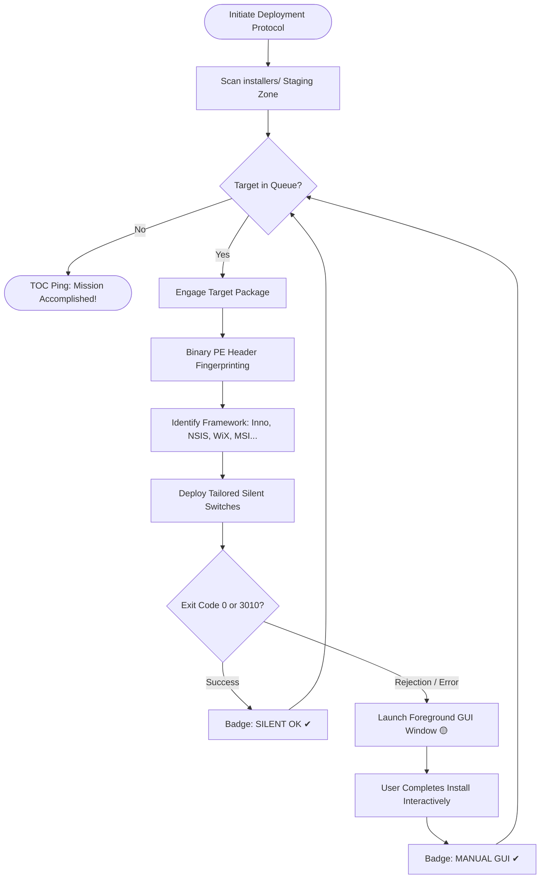

<div align="center">

```
  ___           _        _ _                    _   _       _   
 |_ _|_ __  ___| |_ __ _| | |   ___  _ __      | \ | | ___ | |_ 
  | || '_ \/ __| __/ _` | | |  / _ \| '__|____ |  \| |/ _ \| __|
  | || | | \__ \ || (_| | | | | (_) | | |_____|| |\  | (_) | |_ 
 |___|_| |_|___/\__\__,_|_|_|  \___/|_|        |_| \_|\___/ \__|
```

### Tactical Post-Provisioning & Automated Deployment Suite for Windows
*Inspired by the gritty operational realism of Ready or Not.*

[](https://github.com/Uwedwa/install-or-not)
[](https://www.python.org/)
[](https://github.com/Uwedwa/install-or-not)
[](https://github.com/Uwedwa/install-or-not/releases)
[](LICENSE)

<p align="center">
  <b><a href="README.md">English</a></b> • <b><a href="README_TR.md">Türkçe</a></b>
</p>

```
   ______________________________________________________________________
  /                                                                      \
 |   [TOC] "Entry team, command center established. Awaiting orders."     |
 |   [ENTRY TEAM] "High ground secured. Tactical armory ready to engage." |
  \______________________________________________________________________/
```

</div>

---

## 📑 Mission Directives

- [🎯 TOC Mission Briefing](#-toc-mission-briefing)
- [⚡ What's New in Tactical 2.0](#-whats-new-in-tactical-20)
- [🧠 PE Binary Ballistics (Smart Detection)](#-pe-binary-ballistics-smart-detection)
- [🎯 Tactical Winget Armory Kits](#-tactical-winget-armory-kits)
- [🔄 Standard Operating Procedure (Flowchart)](#-standard-operating-procedure-flowchart)
- [🚀 Deployment Operations (2 Usage Methods)](#-deployment-operations-2-usage-methods)
  - [🟢 Method 1: Standalone Single Binary (.exe) (Recommended)](#-method-1-standalone-single-binary-exe-recommended)
  - [🛠️ Method 2: Running from Source (Python)](#️-method-2-running-from-source-python)
- [📦 Compiling Field Executable (.exe)](#-compiling-field-executable-exe)
- [📻 TOC Radio Transmissions](#-toc-radio-transmissions)
- [📁 Tactical Blueprint (Architecture)](#-tactical-blueprint-architecture)
- [🎗️ Debrief & Credits](#️-debrief--credits)

---

## 🎯 TOC Mission Briefing

Setting up a clean Windows machine shouldn't feel like navigating a hostile minefield of installer wizards, bundled bloatware, and frozen command prompts.

**INSTALL OR NOT 2.0** turns post-format provisioning into an elite, coordinated tactical breach:
* **Staging Zone:** Drop your `.exe` and `.msi` installers into the `installers/` breach point.
* **Deep PE Inspection:** The zero-dependency binary scanner inspects portable executable headers to identify whether the target was packed with **Inno Setup, NSIS, WiX / Burn, InstallShield, 7-Zip SFX, Advanced Installer, or Microsoft Installer (MSI)**.
* **Tailored Silent Strikes:** Dispatches the exact unattended command-line flags required by that specific engine, eliminating parameter conflicts.
* **Interactive Fallback Protocol:** If an installer resists unattended deployment, the engine gracefully launches the interactive setup window in the foreground so you can clear the objective manually without stalling the mission queue.
* **Winget Armory On-Demand:** No local files? Switch to the **🎯 WINGET ARMORY** tab to deploy pre-configured loadout kits (Gaming Vanguard, Operator DevKit, Recon) with a single click.

---

## ⚡ What's New in Tactical 2.0

| Operational Capability | Legacy v1.0 | 🚀 Tactical v2.0 |
| :--- | :--- | :--- |
| **Engine Recon** | None (Blind parameter pass) | **Zero-dependency PE binary header fingerprinting** |
| **Silent Flag Execution** | Clashing flags (`/S /SILENT /quiet` all at once) | **Engine-tailored argument dispatch** (Zero syntax crashes) |
| **Tactical HUD** | Basic Tkinter text box | **Cyber Dark HUD**, live status cards & progress tracking |
| **Status Feedback** | Plain console log | **Visual badges (`QUEUED`, `DEPLOYING`, `✔ SILENT OK`, `🟡 MANUAL GUI`, `❌ FAILED`)** |
| **Winget Armory** | Simple command run | **Curated 1-Click Loadout Kits** (Gaming, Dev, Recon) |
| **Queue Resilience** | Script halts on error | **Multi-threaded background queue with timeout protection** |
| **Audio Comms** | Silent | **Tactical audio milestones via native system frequency beeps** |
| **Portability** | Python installation required | **Standalone portable binary (`Install_or_Not.exe`)** |

---

## 🧠 PE Binary Ballistics (Smart Detection)

Different installer frameworks reject foreign switches. **Install or Not 2.0** scans the leading 512 KB and trailing 64 KB of the binary for magic byte signatures and dispatches the exact flags:

| Packaging Engine | Target Signature / Byte Pattern | Tailored Silent Arguments |
| :--- | :--- | :--- |
| **Inno Setup** | `Inno Setup Setup Data`, `InnoSetup` | `/VERYSILENT /NORESTART /SUPPRESSMSGBOXES /SP-` |
| **NSIS (Nullsoft)** | `NullsoftInst`, `Nullsoft.NSIS` | `/S` *(Strictly uppercase)* |
| **WiX / Burn** | `WixBurn`, `WixAttachedContainer` | `/quiet /norestart` |
| **InstallShield** | `InstallShield`, `ISSetup.dll` | `/s /v"/qn /norestart"` |
| **7-Zip SFX** | `7z\xbc\xaf\x27\x1c`, `7zS.sfx` | `-y` |
| **Advanced Installer** | `Advanced Installer`, `Caphyon` | `/exenoui /qn /norestart` |
| **MSI Package** | Windows Installer Compound Container | `msiexec /i <file> /qn /norestart /passive` |
| **Generic Fallback** | Unknown PE | Gradual safe probe ➔ Automatic GUI Fallback |

---

## 🎯 Tactical Winget Armory Kits

Need rapid loadouts without local setup files? Access the **🎯 WINGET ARMORY** tab to deploy specialized profiles:

```
├── 🎮 Gaming Vanguard
│   ├── Valve Steam
│   ├── Discord
│   ├── OBS Studio
│   ├── 7-Zip
│   ├── Visual C++ 2015-2022 All-in-One
│   └── DirectX End-User Runtime
│
├── 💻 Operator DevKit
│   ├── Git for Windows
│   ├── Visual Studio Code
│   ├── Windows Terminal
│   ├── Python 3.12
│   ├── Node.js LTS
│   └── Docker Desktop
│
└── 🌐 Recon & Daily Ops
    ├── Brave Browser
    ├── VLC Media Player
    ├── Spotify
    ├── ShareX
    ├── qBittorrent
    └── Notepad++
```

---

## 🔄 Standard Operating Procedure (Flowchart)



---

## 🚀 Deployment Operations (2 Usage Methods)

### 🟢 Method 1: Standalone Single Binary (.exe) (Recommended)

> **Zero Dependencies:** Does not require Python or external libraries. Ideal for deployment USB drives and fresh Windows installations.

1. **Acquire Binary:** Download the latest `Install_or_Not.exe` from [**GitHub Releases**](https://github.com/Uwedwa/install-or-not/releases).
2. **Staging Zone:** In the same folder as `Install_or_Not.exe`, create an `installers` folder:
   ```cmd
   mkdir installers
   ```
3. **Load Assets:** Drag and drop your `.exe` and `.msi` installers into the `installers/` folder.
4. **Execute:** Right-click `Install_or_Not.exe` and select **Run as Administrator**.
5. **Engage:** Click **Engage Deployment** on the Tactical HUD and watch the automated deployment unfold.

---

### 🛠️ Method 2: Running from Source (Python)

> **For Developers:** Ideal for inspecting the codebase, extending detection signatures, or contributing.

#### Prerequisites
- **Windows 10 / 11**
- **Python 3.10+**
- Administrator privileges

#### Quick Start

```powershell
# 1. Clone repository & enter directory
git clone https://github.com/Uwedwa/install-or-not.git
cd install-or-not

# 2. Install UI dependencies (Pillow)
pip install -r requirements.txt

# 3. Create installers staging zone
mkdir installers

# 4. Launch Tactical HUD
python install_or_not.py
```

---

## 📦 Compiling Field Executable (.exe)

To forge your own standalone single-file binary with embedded assets:

```powershell
# 1. Install build tools
pip install pyinstaller pillow

# 2. Compile standalone windowed binary
python -m PyInstaller --noconfirm --onefile --windowed `
  --name "Install_or_Not" `
  --collect-all core `
  install_or_not.py
```

The completed field binary will be produced in `dist/Install_or_Not.exe`.

---

## 📻 TOC Radio Transmissions

The integrated **TOC Communications HUD** delivers live feedback straight from command operations:

* 🟢 `[SUCCESS]` *"Entry team to TOC, mission complete. All targets secured."*
* 🟢 `[SUCCESS]` *"High ground secured. All software deployed without casualties."*
* 🟡 `[WARNING]` *"Silent deployment exited with non-zero code. Initiating interactive GUI fallback..."*
* 🔴 `[CRITICAL]` *"Hostiles encountered during package deployment! Error reported."*

---

## 📁 Tactical Blueprint (Architecture)

```
install-or-not/
├── install_or_not.py          # Tactical HUD Application & GUI Driver
├── core/
│   ├── __init__.py            # Core module initialization
│   ├── detector.py            # Zero-dependency binary PE installer fingerprinting
│   ├── executor.py            # Multi-threaded execution & GUI fallback engine
│   └── presets.py             # Winget armory loadouts & profile management
├── installers/                # Tactical staging zone for .exe and .msi packages
├── requirements.txt           # Minimal runtime dependencies
├── LICENSE                    # GNU General Public License v3.0
├── README.md                  # Tactical Field Manual (English)
└── README_TR.md               # Taktik Saha El Kitabı (Türkçe)
```

---

## 🎗️ Debrief & Credits

* **Operator:** Built with precision by **[uwedwa](https://github.com/Uwedwa)**.
* **Atmosphere:** Inspired by the tactical realism and audio design of *Ready or Not* (VOID Interactive).
* **License:** This project is licensed under the terms of the **GNU General Public License v3.0**. See the [LICENSE](LICENSE) file for details.

<div align="center">
  <sub>Made with Python, caffeine, and operational discipline. Talk to me, TOC!</sub>
</div>
