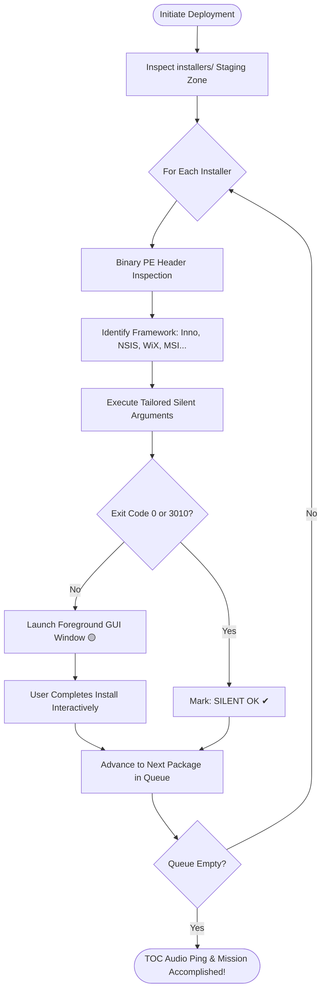

<div align="center">

# ⚡ INSTALL OR NOT 2.0
### *Tactical Package Deployment Suite // TOC Command*

[](https://www.gnu.org/licenses/gpl-3.0)
[](https://github.com/Uwedwa/install-or-not/releases)
[](https://microsoft.com/windows)
[](https://python.org)

<p align="center">
  <b>A zero-friction, semi-automated tactical software deployment workstation for fresh Windows installations.</b><br>
  <i>Inspects executable PE headers, fingerprints packaging engines, and deploys with surgical silent precision.<br>If silent deployment fails, it smoothly falls back to interactive GUI without breaking the mission queue.</i>
</p>

```
    ____________________________________________________________________
   /                                                                    \
  |   [TOC] "Entry team, command center established. Awaiting orders."   |
  |   [ENTRY TEAM] "High ground secured. Tactical armory engaged."      |
   \____________________________________________________________________/
```

</div>

---

## 📑 Table of Contents

- [🎯 Mission Overview](#-mission-overview)
- [⚡ What's New in 2.0](#-whats-new-in-20)
- [🧠 Smart Engine Fingerprinting](#-smart-engine-fingerprinting)
- [🎯 Tactical Winget Armory Kits](#-tactical-winget-armory-kits)
- [🔄 Operational Flowchart](#-operational-flowchart)
- [🚀 Rapid Deployment (Getting Started)](#-rapid-deployment-getting-started)
- [📦 Compiling Standalone Binary (.exe)](#-compiling-standalone-binary-exe)
- [📻 TOC Field Directives & Radio Comms](#-toc-field-directives--radio-comms)
- [📁 Project Architecture](#-project-architecture)
- [🎗 License & Credits](#-license--credits)

---

## 🎯 Mission Overview

Setting up a fresh Windows machine is traditionally tedious: hunting installer links, clicking through wizard checkboxes, and navigating bundled bloatware.

**INSTALL OR NOT 2.0** turns post-format provisioning into an elite military operation:
* Drop your preferred `.exe` and `.msi` installers into the `installers/` staging zone.
* The internal **PE Header Scanner** inspects the binary bytes to discover whether the setup was packaged with **Inno Setup, NSIS, WiX, InstallShield, 7-Zip, or Microsoft Installer (MSI)**.
* Instead of blindly firing conflicting flags, it launches the exact silent parameters accepted by that specific engine.
* If a package rejects silent installation, **the interactive installer window smoothly spawns in the foreground**, allowing you to finish manually while keeping the rest of the deployment queue intact.
* Need common tools right away? Engage the **Winget Armory** to pull pre-configured, bloat-free kits (Gaming, Dev, Recon) with a single click.

---

## ⚡ What's New in 2.0

| Feature | Legacy v1.0 | 🚀 Tactical v2.0 |
| :--- | :--- | :--- |
| **Engine Detection** | None (Blind parameter pass) | **Zero-dependency binary PE header fingerprinting** |
| **Silent Flags** | Dumped all flags (`/S`, `/SILENT`, `/quiet` together) | **Engine-tailored arguments** (Prevents syntax crashes) |
| **Interface** | Plain retro Tkinter text console | **Modern Cyber Dark HUD**, live status cards & progress bar |
| **Status Feedback** | Text-only log box | **Card badges (`QUEUED`, `DEPLOYING`, `✔ SILENT OK`, `🟡 MANUAL GUI`, `❌ FAILED`)** |
| **Winget Armory** | Basic command runner | **Curated 1-Click Loadout Kits** (Gaming, Dev, Daily Media) |
| **Queue Resilience** | Hangs on failure | **Multi-threaded non-blocking queue with process timeout** |
| **Audio Ops** | Silent | **Tactical frequency beeps on milestones (`winsound`)** |

---

## 🧠 Smart Engine Fingerprinting

Different installer frameworks react violently to foreign flags. **Install or Not 2.0** inspects the first 512 KB and trailing 64 KB of the file for binary signatures and dispatches the exact flags:

| Packaging Engine | Target Signature | Tailored Silent Arguments |
| :--- | :--- | :--- |
| **Inno Setup** | `Inno Setup Setup Data`, `InnoSetup` | `/VERYSILENT /NORESTART /SUPPRESSMSGBOXES /SP-` |
| **NSIS (Nullsoft)** | `NullsoftInst`, `Nullsoft.NSIS` | `/S` *(Strictly uppercase)* |
| **WiX / Burn** | `WixBurn`, `WixAttachedContainer` | `/quiet /norestart` |
| **InstallShield** | `InstallShield`, `ISSetup.dll` | `/s /v"/qn /norestart"` |
| **7-Zip SFX** | `7z\xbc\xaf\x27\x1c`, `7zS.sfx` | `-y` |
| **Advanced Installer** | `Advanced Installer`, `Caphyon` | `/exenoui /qn /norestart` |
| **MSI Package** | `.msi` container | `msiexec /i <file> /qn /norestart /passive` |
| **Generic Fallback** | Unknown PE | Gradual safe probe ➔ Automatic GUI Fallback |

---

## 🎯 Tactical Winget Armory Kits

No local installers on hand? Switch to the **🎯 WINGET ARMORY** tab to deploy battle-tested loadouts:

```
├── 🎮 Gaming Vanguard
│   ├── Valve Steam
│   ├── Discord
│   ├── OBS Studio
│   ├── 7-Zip
│   ├── Visual C++ 2015-2022 All-in-One
│   └── DirectX End-User Runtime
│
├── 💻 Operator DevKit
│   ├── Git
│   ├── Visual Studio Code
│   ├── Windows Terminal
│   ├── Python 3.12
│   ├── Node.js LTS
│   └── Docker Desktop
│
└── 🌐 Recon & Daily Ops
    ├── Brave Browser
    ├── VLC Media Player
    ├── Spotify
    ├── ShareX
    ├── qBittorrent
    └── Notepad++
```

---

## 🔄 Operational Flowchart



---

## 🚀 Rapid Deployment (Getting Started)

### Prerequisites
- **Windows 10 / 11**
- **Python 3.10+** (if running from source)
- Administrator privileges recommended (to bypass UAC prompts)

### Clone & Run

```bash
# 1. Clone repository
git clone https://github.com/Uwedwa/install-or-not.git
cd install-or-not

# 2. Install dependencies (Pillow for embedded icon)
pip install -r requirements.txt

# 3. Drop your .exe or .msi files into installers/
mkdir installers

# 4. Engage deployment suite
python install_or_not.py
```

---

## 📦 Compiling Standalone Binary (.exe)

Turn **Install or Not 2.0** into a completely standalone `.exe` you can carry on a USB drive without requiring Python on target machines:

```bash
pip install pyinstaller

pyinstaller --noconfirm --onedir --windowed \
  --name "Install_or_Not_v2" \
  install_or_not.py
```
> The generated binary will be located inside the `dist/Install_or_Not_v2/` folder.

---

## 📻 TOC Field Directives & Radio Comms

The integrated **TOC Communications HUD** delivers live feedback straight from the operational command:

* 🟢 `[SUCCESS]` *"Entry team to TOC, mission complete. All targets secured."*
* 🟢 `[SUCCESS]` *"High ground secured. All software deployed without casualties."*
* 🟡 `[WARNING]` *"Silent deployment exited with code 1. Initiating GUI fallback..."*
* 🔴 `[CRITICAL]` *"Hostiles encountered during package deployment! Error reported."*

---

## 📁 Project Architecture

```
install-or-not/
├── install_or_not.py          # Tactical HUD Application & GUI Driver
├── core/
│   ├── __init__.py            # Core module initialization
│   ├── detector.py            # Zero-dependency binary PE installer fingerprinting
│   ├── executor.py            # Multi-threaded execution & GUI fallback engine
│   └── presets.py             # Winget armory kits & profile export/import
├── installers/                # Tactical staging zone for .exe and .msi packages
├── requirements.txt           # Minimal runtime dependencies
├── LICENSE                    # GNU General Public License v3.0
└── README.md                  # Comprehensive operational manual
```

---

## 🎗 License & Credits

* **Author:** Built with precision by **[uwedwa](https://github.com/Uwedwa)**.
* **Atmosphere:** Inspired by the tactical realism of *Ready or Not* (VOID Interactive).
* **License:** This project is licensed under the terms of the **GNU General Public License v3.0**. See the [LICENSE](LICENSE) file for details.

<div align="center">
  <sub>Made with Python, caffeine, and tactical operational discipline.</sub>
</div>
