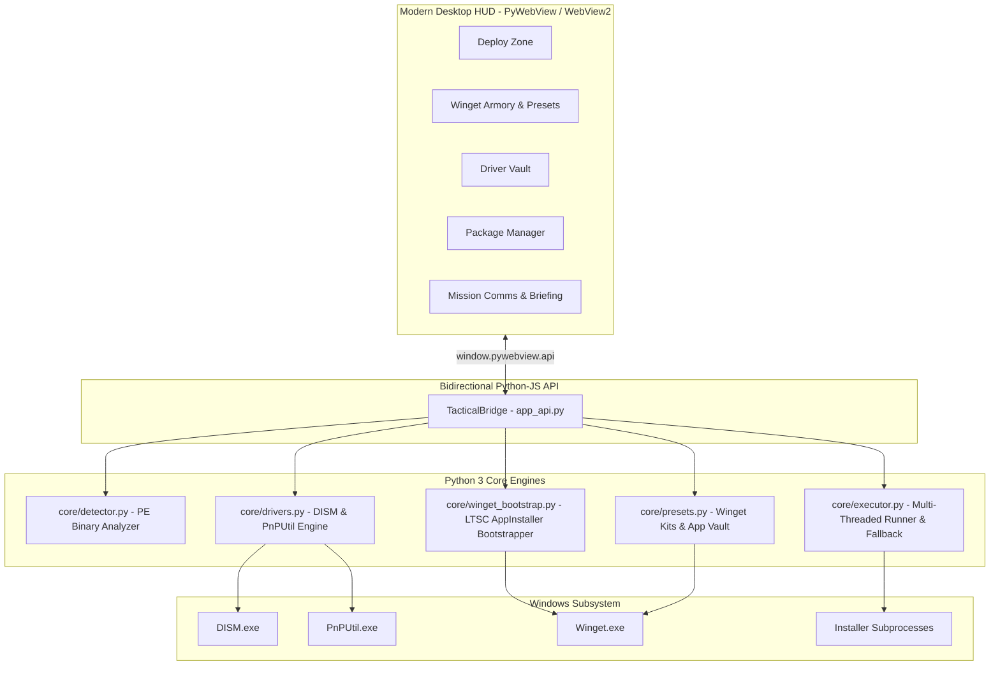

# Install or Not

> Intelligent, unattended post-installation & software deployment orchestrator for Windows.

[](https://github.com/Uwedwa/install-or-not)
[](https://www.python.org/)
[](https://pywebview.flowrl.com/)
[](LICENSE)
[](https://github.com/Uwedwa/install-or-not/releases)

<p align="left">
  <b><a href="README.md">English</a></b> • <b><a href="README_TR.md">Türkçe</a></b>
</p>

---

## Overview

**Install or Not** is a high-performance Windows deployment suite engineered to automate software provisioning, device driver backup/restoration, and application state synchronization after fresh Windows installations.

Instead of navigating repetitive setup wizards, guessing silent CLI switches, or manually reinstalling dozens of utilities, **Install or Not** inspects raw Portable Executable (PE) headers, detects installer engines, injects unattended arguments, backs up OEM hardware drivers, bootstraps Microsoft Winget on clean LTSC systems, and restores complete machine application manifests—all through an ultra-modern glassmorphic desktop interface powered by Microsoft Edge WebView2.

---

## Detailed Features & Technical Operation

### 1. Smart PE Header Detection & Engine Fingerprinting
* **What it does:** Scans any `.exe` or `.msi` file placed in the `installers/` folder and determines its packaging engine without running the executable.
* **How it works:**
  1. Opens the binary file in read-only byte mode (`open(f, "rb")`).
  2. Inspects DOS and PE headers (`IMAGE_DOS_HEADER`, `IMAGE_NT_HEADERS`).
  3. Scans for known byte patterns, section names, and string markers:
     - **Inno Setup:** Matches `Inno Setup Setup Data` or `InnoSetup`.
     - **NSIS (Nullsoft):** Matches `NullsoftInst` or `Nullsoft.NSIS`.
     - **WiX Toolset / Burn:** Matches `WixBurn` or `WixAttachedContainer`.
     - **InstallShield:** Matches `InstallShield` or `ISSetup.dll`.
     - **7-Zip SFX:** Matches `7z\xbc\xaf\x27\x1c` or `7zS.sfx`.
     - **Advanced Installer:** Matches `Advanced Installer` or `Caphyon`.
     - **Microsoft MSI:** Matches OLE Compound Document signature (`\xd0\xcf\x11\xe0\xa1\xb1\x1a\xe1`).
  4. Returns a strongly typed `InstallerProfile` containing the engine name, detection confidence level, and tailored silent command-line arguments.

---

### 2. Multi-Threaded Unattended Execution with GUI Fallback
* **What it does:** Runs installers quietly in sequence, updating real-time progress. If an installer fails or requires user input, it prevents queue stoppage.
* **How it works:**
  1. Spawns an isolated background worker thread executing `subprocess.Popen` with non-blocking pipes and `CREATE_NO_WINDOW`.
  2. Injects the precise silent switches (e.g. `/VERYSILENT /NORESTART /SUPPRESSMSGBOXES /SP-` for Inno, `/S` for NSIS, `/quiet /norestart` for WiX).
  3. Evaluates the exit code. If the code is `0` (or `3010` reboot pending), the task is marked as `✔ SILENT OK`.
  4. **Automatic Fallback:** If the process exits with a non-zero error code or silent flags fail, the suite automatically re-launches the installer with full interactive GUI in the foreground (`SW_SHOWNORMAL`). The operator completes the wizard manually, and the suite immediately resumes the remaining queue.

---

### 3. Driver Vault: Native Hardware Driver Backup & Restore
* **What it does:** Backs up all installed third-party OEM hardware drivers (GPU, Wi-Fi, Ethernet, Bluetooth, Audio, Chipset) before formatting, and batch-reinstalls them on a newly installed OS with a single click.
* **How it works:**
  * **Backup Phase:**
    - Executes native Windows Deployment Image Servicing and Management (`DISM.exe`):
      ```powershell
      dism /online /export-driver /destination:<target_backup_directory>
      ```
    - Extracts only third-party OEM driver packages (`oem*.inf`), ignoring built-in inbox drivers to keep backups lightweight and portable.
  * **Restore Phase:**
    - Scans the backup folder and invokes the Windows PnP Utility (`pnputil.exe`):
      ```powershell
      pnputil /add-driver <source_backup_directory>\*.inf /subdirs /install
      ```
    - Recursively registers and installs all driver packages without requiring internet access.
  * **Live Stream:** Outputs live console stdout/stderr directly into the Driver Vault Live Terminal.

---

### 4. Winget Armory & Native LTSC Bootstrapper
* **What it does:** Provides instant online access to thousands of software packages via the Windows Package Manager (`winget`), while offering a 1-click bootstrap mechanism for Windows 10/11 LTSC editions where Microsoft Store is stripped out.
* **How it works:**
  * **LTSC Bootstrapper:**
    - Checks for `winget.exe`. If missing or broken, downloads official signed Microsoft dependencies directly:
      1. `Microsoft.VCLibs.x64.14.00.Desktop.appx` (Visual C++ Runtime)
      2. `Microsoft.UI.Xaml.2.8.x64.appx` (WinUI 2.8 Framework)
      3. `Microsoft.DesktopAppInstaller_8wekyb3d8bbwe.msixbundle` (Official Winget Client)
    - Automatically stages and registers them via PowerShell (`Add-AppxPackage`), making `winget` immediately accessible without a Microsoft Account or Store.
  * **Package Recon & Deployment:**
    - Executes `winget search <query> --source winget` and formats results cleanly.
    - Installs packages via `winget install --id <ID> -e --silent --accept-package-agreements --accept-source-agreements`.

---

### 5. Application Vault: Machine Software Backup & Sync
* **What it does:** Backs up all installed software on the current computer to a lightweight JSON manifest, and allows unattended mass restoration on any other PC.
* **How it works:**
  * **Export:** Invokes `winget export -o <file.json> --include-versions --accept-source-agreements` to dump installed packages, repository sources, and version tags into a standard JSON schema.
  * **Import:** Invokes `winget import -i <file.json> --ignore-unavailable --accept-package-agreements --accept-source-agreements` to parse the manifest, resolve dependencies, and batch install software automatically.

---

### 6. Curated Tactical Armory Kits (Default: Floorp Browser)
* **What it does:** Delivers one-click preset bundles tailored for immediate post-format productivity:
  - **Floorp Browser Kit:** Ablaze Floorp Browser (privacy-focused, highly customizable Firefox fork), uBlock Origin, and web essentials.
  - **Developer Kit:** Visual Studio Code, Git, Python, Windows Terminal, 7-Zip.
  - **Gamer & Media Kit:** Steam, Discord, VLC Media Player, Spotify.
* **How it works:** Iterates through predefined package arrays in `core/presets.py` and queues unattended Winget deployments with real-time operational feedback.

---

### 7. Package Management Hub
* **What it does:** File manager for local installer staging.
* **How it works:** Allows importing `.exe` and `.msi` packages via native Windows Explorer dialogs, selecting specific subsets with checkboxes, batch-deploying selected packages, or deleting unwanted files.

---

### 8. Ultra-Modern PyWebView GUI
* **What it does:** Delivers a dark, responsive, glassmorphic desktop interface.
* **How it works:**
  - Powered by **PyWebView 6.x** backed by the local **Microsoft Edge WebView2** runtime.
  - Implements a bidirectional Python-JS asynchronous bridge (`TacticalBridge` via `window.pywebview.api`).
  - Utilizes Web Audio API to synthesize responsive tactical audio cues (high-frequency chirps, warning tones).
  - Displays color-coded live streaming logs in Mission Comms and Driver Vault terminals.
  - Displays read-only Field Operator Briefing directives.

---

## Supported Installer Engines

| Engine | Byte Signatures | Silent Arguments |
| :--- | :--- | :--- |
| **Inno Setup** | `Inno Setup Setup Data`, `InnoSetup` | `/VERYSILENT /NORESTART /SUPPRESSMSGBOXES /SP-` |
| **NSIS (Nullsoft)** | `NullsoftInst`, `Nullsoft.NSIS` | `/S` |
| **WiX / Burn** | `WixBurn`, `WixAttachedContainer` | `/quiet /norestart` |
| **InstallShield** | `InstallShield`, `ISSetup.dll` | `/s /v"/qn /norestart"` |
| **7-Zip SFX** | `7z\xbc\xaf\x27\x1c`, `7zS.sfx` | `-y` |
| **Advanced Installer** | `Advanced Installer`, `Caphyon` | `/exenoui /qn /norestart` |
| **Microsoft MSI** | Compound document / OLE container | `msiexec /i <file> /qn /norestart /passive` |
| **Generic / Unknown** | Unidentified PE file | Safe probe → Automatic Interactive Fallback |

---

## Architecture Diagram



---

## Installation & Usage

### Method 1: Standalone Portable Binary (Recommended)
> No Python or external dependencies required.

1. Download **`Install_or_Not.exe`** from [**Releases**](https://github.com/Uwedwa/install-or-not/releases).
2. Place `Install_or_Not.exe` in its own folder (e.g. on a USB drive or Desktop).
3. Right-click and choose **Run as Administrator** (required for DISM driver backups and silent package installations).
4. Drop your `.exe` and `.msi` installers into the auto-created `installers/` directory.
5. Click **Engage Deployment (All Packages)**.

---

### Method 2: Running from Source

Requires **Python 3.10+** on Windows 10/11.

```powershell
# 1. Clone repository
git clone https://github.com/Uwedwa/install-or-not.git
cd install-or-not

# 2. Install dependencies
pip install -r requirements.txt

# 3. Launch application
python install_or_not.py
```

---

## Compiling Standalone Executable

To bundle the entire suite, web assets, and dependencies into a single portable binary:

```powershell
pip install pyinstaller pywebview pillow
python -m PyInstaller --noconfirm Install_or_Not.spec
```

The resulting binary will be in `dist/Install_or_Not.exe`.

---

## Project Structure

```
install-or-not/
├── install_or_not.py       # Application entry point (PyWebView Window setup)
├── app_api.py              # Bidirectional Python-JS Tactical Bridge
├── Install_or_Not.spec     # PyInstaller single-file build specification
├── app_icon.ico            # Application icon
├── core/
│   ├── __init__.py         # Package declaration
│   ├── detector.py         # Binary PE header fingerprinting engine
│   ├── drivers.py          # Native driver backup & restore (DISM/PnPUtil)
│   ├── executor.py         # Multi-threaded installer runner & GUI fallback
│   ├── presets.py          # Winget Armory kits & App Vault manifest sync
│   └── winget_bootstrap.py # LTSC-ready offline/online Winget bootstrapper
├── ui/
│   ├── index.html          # Glassmorphic layout & viewports
│   ├── style.css           # Cyber Dark tactical styling & animations
│   └── app.js              # Reactive UI controller & Web Audio synthesizer
├── installers/             # Staging folder for offline installer packages
├── requirements.txt        # Python dependencies (pywebview, pillow)
├── LICENSE                 # GNU GPL-3.0
├── README.md               # English documentation
└── README_TR.md            # Turkish documentation
```

---

## Acknowledgements

The visual theme, terminology, and command structure of **Install or Not** were inspired by the tactical simulation game [*Ready or Not*](https://store.steampowered.com/app/1144200/Ready_or_Not/) by VOID Interactive.

---

## License

This project is licensed under the [GNU General Public License v3.0](LICENSE).
