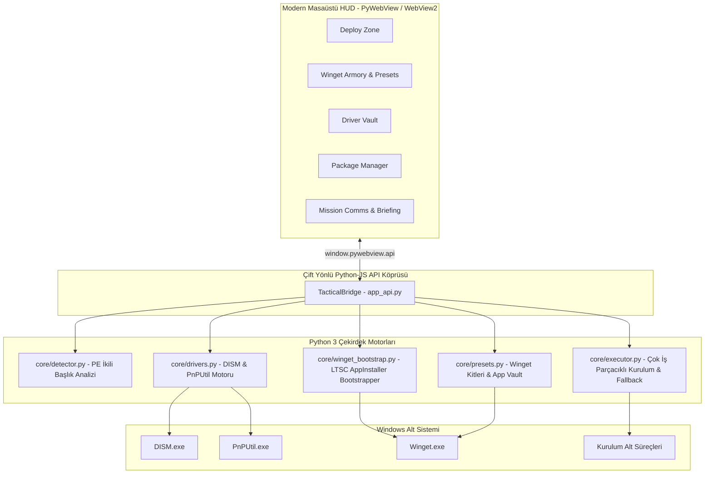

# Install or Not

<p align="center">
  
</p>

> Windows için akıllı, katılımsız kurulum & yazılım dağıtım orkestratörü.

[](https://github.com/Uwedwa/install-or-not)
[](https://www.python.org/)
[](https://pywebview.flowrl.com/)
[](LICENSE)
[](https://github.com/Uwedwa/install-or-not/releases)

<p align="left">
  <b><a href="README.md">English</a></b> • <b><a href="README_TR.md">Türkçe</a></b>
</p>

---

## Genel Bakış

**Install or Not**, format sonrası veya yeni bir bilgisayar kurulumunda program yükleme süreçlerini, sürücü yedeklemelerini ve uygulama eşitlemesini tamamen otomatikleştiren yüksek performanslı bir Windows dağıtım paketidir.

Kullanıcıyı sıradan kurulum sihirbazlarına tıklamaktan, sessiz parametreleri aramaktan veya format sonrası onlarca programı tek tek kurmaktan kurtarır. İkili PE başlıklarını (PE Headers) analiz eder, paketleyici motoru tanır, uygun parametreleri enjekte eder, OEM donanım sürücülerini yedekler, temiz LTSC sistemlerine tek tıkla Microsoft Winget'i kurar ve kurulu uygulamaları JSON olarak yedekleyip geri yükler.

---

## Detaylı Özellikler ve Nasıl Çalıştıkları

### 1. Akıllı PE Başlık Tespiti ve Motor Parmak İzi (PE Header Inspection)
* **Ne yapar:** `installers/` dizinine bırakılan herhangi bir `.exe` veya `.msi` dosyasını çalıştırmadan, dosyanın bayt yapısını tarayarak paketleme motorunu otomatik tespit eder.
* **Nasıl çalışır:**
  1. Dosyayı salt okunur ikili modda açar (`open(f, "rb")`).
  2. DOS ve PE başlıklarını (`IMAGE_DOS_HEADER`, `IMAGE_NT_HEADERS`) inceler.
  3. Bilinen sihirli baytları (magic bytes), bölüm adlarını ve imza dizgilerini arar:
     - **Inno Setup:** `Inno Setup Setup Data` veya `InnoSetup`.
     - **NSIS (Nullsoft):** `NullsoftInst` veya `Nullsoft.NSIS`.
     - **WiX Toolset / Burn:** `WixBurn` veya `WixAttachedContainer`.
     - **InstallShield:** `InstallShield` veya `ISSetup.dll`.
     - **7-Zip SFX:** `7z\xbc\xaf\x27\x1c` veya `7zS.sfx`.
     - **Advanced Installer:** `Advanced Installer` veya `Caphyon`.
     - **Microsoft MSI:** OLE Bileşik Belge başlığı (`\xd0\xcf\x11\xe0\xa1\xb1\x1a\xe1`).
  4. Motor adını, güvenilirlik oranını ve enjekte edilecek sessiz kurulum parametrelerini içeren bir `InstallerProfile` nesnesi döndürür.

---

### 2. Çok İş Parçacıklı Katılımsız Kurulum ve Otomatik GUI Güvenlik Ağı (Fallback)
* **Ne yapar:** Kurulumları arka planda sırayla ve sessizce çalıştırır. Eğer bir kurulum sessiz parametreleri desteklemezse ya da hata verirse tüm kuyruğun kilitlenmesini önler.
* **Nasıl çalışır:**
  1. Arka planda `subprocess.Popen` ile penceresiz (`CREATE_NO_WINDOW`) bir iş parçacığı başlatır.
  2. Tespit edilen motora göre optimize edilmiş parametreleri enjekte eder (Inno için `/VERYSILENT /NORESTART /SUPPRESSMSGBOXES /SP-`, NSIS için `/S`, WiX için `/quiet /norestart` vb.).
  3. Çıkış kodunu inceler. Çıkış kodu `0` (veya yeniden başlatma bekleyen `3010`) ise görev `✔ SILENT OK` olarak işaretlenir.
  4. **Otomatik Güvenlik Ağı (Fallback):** Eğer kurulum sıfırdan farklı bir hata koduyla sonlanırsa veya sessiz bayrakları tanımazsa, uygulama derhal kurulumu normal etkileşimli grafik penceresinde (`SW_SHOWNORMAL`) ön plana açar. Kullanıcı adımları tamamlayıp pencereyi kapattığında kuyruk kaldığı yerden sıradaki pakete devam eder.

---

### 3. Sürücü Kasası (Driver Vault): Yerel Sürücü Yedekleme & Geri Yükleme
* **Ne yapar:** Format atmadan önce sistemdeki tüm 3. parti OEM donanım sürücülerini (Ekran Kartı, Wi-Fi, Ethernet, Bluetooth, Ses, Anakart/Chipset) tek tıkla taşınabilir bir klasöre yedekler; format sonrasında internete ihtiyaç duymadan tek tıkla kurar.
* **Nasıl çalışır:**
  * **Yedekleme (Format Öncesi):**
    - Windows'un yerel Dağıtım Görüntüsü Bakımı ve Yönetimi (`DISM.exe`) aracını çalıştırır:
      ```powershell
      dism /online /export-driver /destination:<hedef_klasor>
      ```
    - Windows'un yerleşik sürücülerini atlayarak yalnızca üreticilerin harici OEM sürücü paketlerini (`oem*.inf`) ayıklar. Bu sayede yedek hafif ve taşınabilir kalır.
  * **Geri Yükleme (Format Sonrası):**
    - Hedef klasörü tarar ve Windows Tak ve Kullan Yardımcı Programı (`pnputil.exe`) ile toplu kurulum yapar:
      ```powershell
      pnputil /add-driver <kaynak_klasor>\*.inf /subdirs /install
      ```
    - Klasördeki tüm `.inf` paketlerini Windows sürücü deposuna ekleyip donanımlara otomatik bağlar.
  * **Canlı Çıktı:** DISM ve PnPUtil çıktısı Driver Vault Live Terminal penceresinde anlık olarak akar.

---

### 4. Winget Cephaneliği & Yerel LTSC Bootstrapper
* **Ne yapar:** Windows Paket Yöneticisi (`winget`) üzerinden binlerce programa tek tıkla erişim sağlar. Microsoft Store bulunmayan temiz Windows 10/11 LTSC ve Enterprise sürümlerinde bile Winget'i tek tıkla kurabilir.
* **Nasıl çalışır:**
  * **LTSC Bootstrapper:**
    - Sistemde `winget.exe` olup olmadığını kontrol eder. Yoksa Microsoft'un resmi imzalı AppX/MSIX paketlerini otomatik indirir:
      1. `Microsoft.VCLibs.x64.14.00.Desktop.appx` (Visual C++ Runtime)
      2. `Microsoft.UI.Xaml.2.8.x64.appx` (WinUI 2.8 Framework)
      3. `Microsoft.DesktopAppInstaller_8wekyb3d8bbwe.msixbundle` (Resmi Winget İstemcisi)
    - PowerShell'in `Add-AppxPackage` komutuyla arka planda sisteme kaydeder. Microsoft Hesabı veya Mağaza olmadan Winget'i tam çalışır hale getirir.
  * **Paket Keşfi & Kurulum:**
    - `winget search <sorgu> --source winget` komutuyla arama yapar.
    - `winget install --id <ID> -e --silent --accept-package-agreements --accept-source-agreements` ile arka planda sessiz kurulum gerçekleştirir.

---

### 5. Uygulama Kasası (Application Vault): Kurulu Programları Eşitleme
* **Ne yapar:** Mevcut bilgisayardaki tüm kurulu programların listesini taşınabilir bir JSON dosyasına yedekler; formatlanan yeni bilgisayarda bu listeyi okuyarak tüm programları topluca indirip kurar.
* **Nasıl çalışır:**
  * **Dışa Aktarma (Export):** `winget export -o <dosya.json> --include-versions --accept-source-agreements` komutu ile kurulu programların ID, kaynak ve sürüm manifestosunu oluşturur.
  * **İçe Aktarma / Geri Yükleme (Import):** `winget import -i <dosya.json> --ignore-unavailable --accept-package-agreements --accept-source-agreements` komutu ile manifestodaki eksik programları sırayla sisteme kurar.

---

### 6. Hazır Taktik Cephanelik Setleri (Winget Armory Kits)
* **Ne yapar:** Format sonrasında en çok ihtiyaç duyulan yazılımları kategorilere ayrılmış hazır cephanelik paketleri halinde tek tıkla kurar:
  - **🎮 Gaming Vanguard:** Oyun platformları, sesli iletişim, yayın araçları ve zorunlu oyun kütüphaneleri.
    * *İçerik:* Steam (`Valve.Steam`), Discord (`Discord.Discord`), OBS Studio (`OBSProject.OBSStudio`), 7-Zip (`7zip.7zip`), Visual C++ 2015-2022 Runtimes (`Microsoft.VCRedist.2015+.x64`), DirectX End-User Runtimes (`Microsoft.DirectX`).
  - **💻 Operator DevKit:** Geliştiriciler ve sistem yöneticileri için temel geliştirme araçları ve çalışma ortamları.
    * *İçerik:* Git (`Git.Git`), Visual Studio Code (`Microsoft.VisualStudioCode`), Windows Terminal (`Microsoft.WindowsTerminal`), Python 3.12 (`Python.Python.3.12`), Node.js LTS (`OpenJS.NodeJS.LTS`), Docker Desktop (`Docker.DockerDesktop`).
  - **🌐 Recon & Daily Ops:** Günlük kullanım, gizlilik odaklı internet gezintisi ve medya araçları.
    * *İçerik:* Floorp Browser (`Ablaze.Floorp`), VLC Media Player (`VideoLAN.VLC`), Spotify (`Spotify.Spotify`), ShareX (`ShareX.ShareX`), qBittorrent (`qBittorrent.qBittorrent`), Notepad++ (`Notepad++.Notepad++`).
* **Nasıl çalışır:** `core/presets.py` içerisindeki tanımlı paket ID'lerini Winget kuyruğuna alarak katılımsız (`--silent --accept-package-agreements --accept-source-agreements`) yükler ve kurulum sürecini anlık olarak log ekranına yansıtır.

---

### 7. Paket Yönetim Merkezi (Package Manager)
* **Ne yapar:** `installers/` klasöründeki yerel kurulum dosyalarını yönetir.
* **Nasıl çalışır:** Windows Gezgini dosya seçicisi ile yeni `.exe` ve `.msi` dosyalarını içe aktarabilir, onay kutuları ile istenen programları seçip sadece onları kurabilir veya gereksiz dosyaları silebilir.

---

### 8. Ultra-Modern PyWebView Kullanıcı Arayüzü
* **Ne yapar:** Koyu siber/taktiksel cam temalı, akıcı ve modern bir masaüstü deneyimi sunar.
* **Nasıl çalışır:**
  - **PyWebView 6.x** ve yerel **Microsoft Edge WebView2** motoru üzerinde çalışır.
  - İki yönlü asenkron Python-JavaScript köprüsü (`TacticalBridge`) üzerinden haberleşir.
  - Web Audio API ile sentetik taktiksel ses efektleri (tıklama, onay ve uyarı sesleri) üretir.
  - Mission Comms ve Driver Vault terminallerinde renk kodlu canlı operasyon logları sunar.
  - Harekat notlarını (Field Operator Briefing) salt okunur taktiksel yönergeler olarak gösterir.

---

## Desteklenen Kurulum Motorları

| Motor | İmza / Bayt Deseni | Sessiz Parametreler |
| :--- | :--- | :--- |
| **Inno Setup** | `Inno Setup Setup Data`, `InnoSetup` | `/VERYSILENT /NORESTART /SUPPRESSMSGBOXES /SP-` |
| **NSIS (Nullsoft)** | `NullsoftInst`, `Nullsoft.NSIS` | `/S` |
| **WiX / Burn** | `WixBurn`, `WixAttachedContainer` | `/quiet /norestart` |
| **InstallShield** | `InstallShield`, `ISSetup.dll` | `/s /v"/qn /norestart"` |
| **7-Zip SFX** | `7z\xbc\xaf\x27\x1c`, `7zS.sfx` | `-y` |
| **Advanced Installer** | `Advanced Installer`, `Caphyon` | `/exenoui /qn /norestart` |
| **Microsoft MSI** | OLE / Bileşik Belge Başlığı | `msiexec /i <dosya> /qn /norestart /passive` |
| **Genel / Bilinmeyen** | Tanımlanamayan PE | Güvenli deneme → Otomatik Etkileşimli Kurulum |

---

## Mimari Şeması



---

## Kurulum ve Kullanım

### Yöntem 1: Bağımsız Taşınabilir .EXE (Önerilen)
> Sistemde Python veya harici kütüphane kurulu olması gerekmez.

1. **`Install_or_Not.exe`** dosyasını [**Releases**](https://github.com/Uwedwa/install-or-not/releases) sayfasından indirin.
2. **Önemli:** `Install_or_Not.exe` dosyasını doğrudan Masaüstünün veya USB belleğinizin kök dizinine koymayın; **mutlaka ayrı bir klasör açarak içine yerleştirin** (örneğin Masaüstünde `Masaüstü\Kurulum\` veya USB belleğinizde `E:\Install_or_Not\` gibi).
   * *Neden?* Uygulama ilk açıldığında bulunduğu dizinde `installers/` (paket klasörü), `drivers_backup/` (sürücü yedekleri) ve operasyon dosyaları oluşturur. Ayrı bir klasörde olması dosyaların masaüstünüze veya flash belleğinize dağılmasını önler.
3. Sağ tıklayıp **Yönetici Olarak Çalıştır**'ı seçin (DISM sürücü işlemleri ve katılımsız kurulumlar için gereklidir).
4. `.exe` ve `.msi` kurulum dosyalarınızı otomatik açılan `installers/` klasörüne kopyalayın.
5. **Engage Deployment (All Packages)** butonuna tıklayın.

---

### Yöntem 2: Kaynak Koddan Çalıştırma

Windows 10/11 üzerinde **Python 3.10+** gerektirir.

```powershell
# 1. Repoyu klonlayın
git clone https://github.com/Uwedwa/install-or-not.git
cd install-or-not

# 2. Bağımlılıkları yükleyin
pip install -r requirements.txt

# 3. Uygulamayı başlatın
python install_or_not.py
```

---

## Tek Dosya (.exe) Olarak Derleme

Tüm web varlıklarını ve modülleri tek bir taşınabilir `.exe` haline getirmek için:

```powershell
pip install pyinstaller pywebview pillow
python -m PyInstaller --noconfirm Install_or_Not.spec
```

Üretilen dosya `dist/Install_or_Not.exe` konumunda yer alacaktır.

---

## Proje Dizini

```
install-or-not/
├── install_or_not.py       # Uygulama giriş noktası (PyWebView Pencere Başlatıcı)
├── app_api.py              # Çift yönlü Python-JS Taktik Köprüsü
├── Install_or_Not.spec     # PyInstaller tek dosya derleme tanımlayıcısı
├── app_icon.ico            # Uygulama simgesi
├── core/
│   ├── __init__.py         # Paket bildirimi
│   ├── detector.py         # PE başlık parmak izi analiz motoru
│   ├── drivers.py          # Yerel sürücü yedekleme & geri yükleme (DISM/PnPUtil)
│   ├── executor.py         # Çok iş parçacıklı kurulum ve GUI fallback
│   ├── presets.py          # Winget Armory kitleri & App Vault eşitleme
│   └── winget_bootstrap.py # LTSC uyumlu çevrimdışı/çevrimiçi Winget yükleyici
├── ui/
│   ├── index.html          # Cam efektli yerleşim ve sekmeler
│   ├── style.css           # Siber taktiksel koyu stil ve animasyonlar
│   └── app.js              # Reaktif arayüz denetleyicisi ve Web Audio sentezleyici
├── installers/             # Kurulum dosyaları klasörü
├── requirements.txt        # Python bağımlılıkları (pywebview, pillow)
├── LICENSE                 # GNU GPL-3.0
├── README.md               # İngilizce dokümantasyon
└── README_TR.md            # Türkçe dokümantasyon
```

---

## İlham ve Teşekkür

**Install or Not** projesinin adı, taktiksel arayüzü ve komut dili VOID Interactive tarafından geliştirilen [*Ready or Not*](https://store.steampowered.com/app/1144200/Ready_or_Not/) oyunundan esinlenmiştir.

---

## Lisans

Bu proje [GNU General Public License v3.0](LICENSE) altında lisanslanmıştır.
