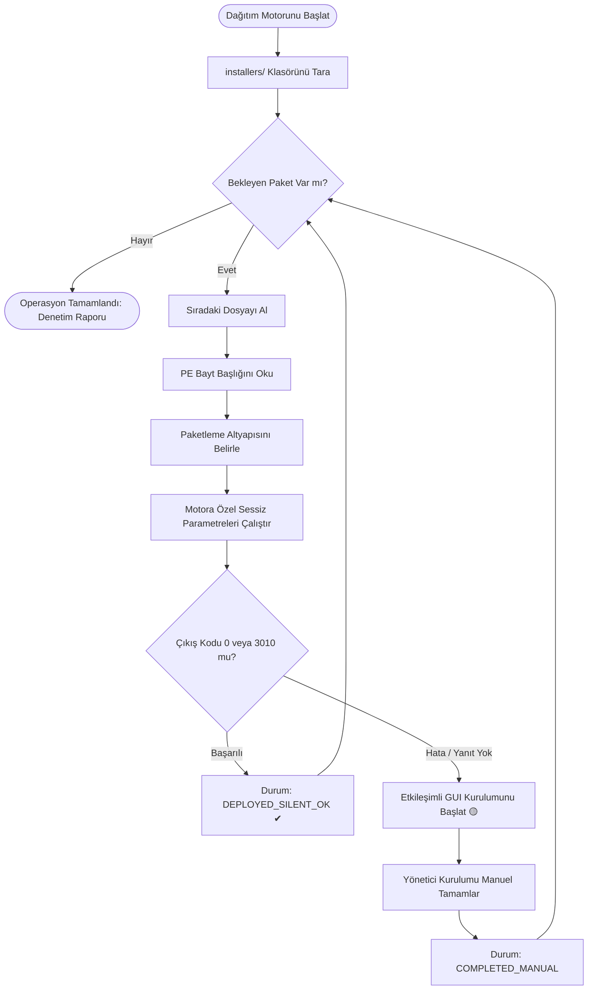

<div align="center">

# Install or Not 2.0
### Kurumsal Windows Kurulum ve Sessiz Dağıtım Otomasyonu

[](https://github.com/Uwedwa/install-or-not)
[](https://www.python.org/)
[](LICENSE)
[](https://github.com/Uwedwa/install-or-not/releases)

<p align="center">
  <b><a href="README.md">English</a></b> • <b><a href="README_TR.md">Türkçe</a></b>
</p>

<p align="center">
  BT yöneticileri, sistem mühendisleri ve kurumsal iş istasyonları için geliştirilmiş yüksek performanslı Windows dağıtım ve provizyon motoru. Çalıştırılabilir (PE) ikili dosya başlıklarını doğrudan analiz eder, paketleme altyapısını çözer ve çakışmasız, katılımsız (sessiz) yazılım kurulumunu otomatik olarak gerçekleştirir.
</p>

</div>

---

## 📋 İçindekiler

- [Yönetici Özeti](#-yönetici-özeti)
- [Temel Mimari Özellikler](#-temel-mimari-özellikler)
- [Kurulum Motoru Tanılama Tablosu](#-kurulum-motoru-tanılama-tablosu)
- [Hazır Kurumsal Dağıtım Profilleri](#-hazır-kurumsal-dağıtım-profilleri)
- [İş Akışı ve Süreç Mimarisi](#-iş-akışı-ve-süreç-mimarisi)
- [Kullanım ve Dağıtım Yöntemleri](#-kullanım-ve-dağıtım-yöntemleri)
  - [Yöntem 1: Bağımsız Taşınabilir .exe (Önerilen)](#yöntem-1-bağımsız-taşınabilir-exe-önerilen)
  - [Yöntem 2: Kaynak Koddan Çalıştırma (Python)](#yöntem-2-kaynak-koddan-çalıştırma-python)
- [Bağımsız Binary (.exe) Derleme](#-bağımsız-binary-exe-derleme)
- [Sistem Mimarisi ve Kod Yapısı](#-sistem-mimarisi-ve-kod-yapısı)
- [Sistem Gereksinimleri ve Güvenlik](#-sistem-gereksinimleri-ve-güvenlik)
- [Lisans ve Yasal Uygunluk](#-lisans-ve-yasal-uygunluk)

---

## 💼 Yönetici Özeti

Yeni kurulan veya formatlanan kurumsal Windows bilgisayarların yazılım provizyonunu gerçekleştirmek çoğunlukla zaman alıcı ve hata payı yüksek bir süreçtir. Sistem yöneticileri; farklı üreticilerin uyumsuz sessiz kurulum parametreleri, istenmeyen ek yazılımlar ve beklenmedik yükleme kesintileriyle uğraşmak durumunda kalır.

**Install or Not 2.0**, modern ve dayanıklı bir otomasyon yaklaşımıyla bu engelleri ortadan kaldırır:
* **Derin İkili Analiz (PE Inspection):** Kurulum dosyalarının bayt seviyesindeki imzalarını inceleyerek paketin hangi motorla (Inno Setup, NSIS, WiX / Burn, InstallShield, 7-Zip SFX veya MSI) hazırlandığını hatasız tespit eder.
* **Belirlenimci Parametre İletimi:** Yalnızca tespit edilen motora uygun sessiz parametreleri göndererek argüman çakışmalarını ve sözdizimi hatalarını önler.
* **Akıllı Etkileşimli Yedekleme (Fallback):** Bir paket sessiz kuruluma direnirse veya özel lisans onayı gerektirirse, süreç kesintiye uğramaz; sistem kurulum sihirbazını ön planda etkileşimli olarak açar. Kullanıcı adımı tamamladığında kuyruktaki diğer yazılımlar çalışmaya devam eder.
* **Entegre Paket Yöneticisi:** Microsoft Windows Paket Yöneticisi (`winget`) üzerinden hazır kurumsal paket profillerini tek tıkla yükleme imkanı sunar.

---

## ⚡ Temel Mimari Özellikler

| Kabiliyet | Geleneksel Yöntemler | Install or Not 2.0 |
| :--- | :--- | :--- |
| **Motor Tespiti** | Dosya adı tahmini veya kör deneme | **Sıfır bağımlılıklı bayt seviyesi PE başlık analizi** |
| **Parametre Yönetimi** | Çakışan bayrakları topluca gönderme (`/S /q /silent`) | **Motora özgü, doğrulanmış parametre eşlemesi** |
| **Kullanıcı Arayüzü** | Donan veya tepkisiz konsol pencereleri | **Modern karanlık tema, anlık durum rozetleri ve ilerleme çubuğu** |
| **Hata Toleransı** | İşlem kilitlenmesi veya betik çökmesi | **Çok iş parçacıklı kuyruk ve otomatik arayüz fallback desteği** |
| **Bulut Depo Entegrasyonu** | Web üzerinden manuel paket arama | **Winget altyapısıyla hazır kurumsal paket setleri** |
| **İşlem Eşzamanlılığı** | Uzun kurulumlarda arayüz kilitlenmesi | **Arka planda çalışan bağımsız iş parçacığı motoru** |
| **Dağıtım Esnekliği** | Hedef sistemde Python zorunluluğu | **Harici bağımlılık gerektirmeyen tek parça `.exe`** |

---

## 🧠 Kurulum Motoru Tanılama Tablosu

Farklı altyapılarla üretilmiş yükleyiciler, yabancı komut satırı argümanları aldıklarında hata verip kapanabilir. **Install or Not 2.0**, dosyanın başlık ve kuyruk baytlarını tarayarak kesin tespit yapar:

| Paketleme Motoru | İkili İmza & Bayt Deseni | Uygulanan Sessiz Kurulum Parametreleri |
| :--- | :--- | :--- |
| **Inno Setup** | `Inno Setup Setup Data`, `InnoSetup` | `/VERYSILENT /NORESTART /SUPPRESSMSGBOXES /SP-` |
| **NSIS (Nullsoft)** | `NullsoftInst`, `Nullsoft.NSIS` | `/S` *(Büyük harf duyarlı)* |
| **WiX / Burn** | `WixBurn`, `WixAttachedContainer` | `/quiet /norestart` |
| **InstallShield** | `InstallShield`, `ISSetup.dll` | `/s /v"/qn /norestart"` |
| **7-Zip SFX** | `7z\xbc\xaf\x27\x1c`, `7zS.sfx` | `-y` |
| **Advanced Installer** | `Advanced Installer`, `Caphyon` | `/exenoui /qn /norestart` |
| **MSI Paketi** | Microsoft Windows Installer Bileşeni | `msiexec /i <dosya> /qn /norestart /passive` |
| **Genel / Tanımlanamayan** | Belirsiz PE Çalıştırılabilir Dosyası | Aşamalı güvenli yoklama ➔ Otomatik arayüz (GUI) başlatma |

---

## 🎯 Hazır Kurumsal Dağıtım Profilleri

Yerel dosyalara ek olarak, arayüzdeki **Winget Entegrasyonu** üzerinden kurumsal ihtiyaçlara yönelik hazır setler kurulabilir:

```
├── 💻 Yazılım Geliştirici İstasyonu
│   ├── Git for Windows
│   ├── Microsoft Visual Studio Code
│   ├── Windows Terminal
│   ├── Python 3.12 Çalışma Zamanı
│   ├── Node.js LTS
│   └── Docker Desktop
│
├── 🏢 Kurumsal Üretkenlik & Ofis
│   ├── Brave Browser
│   ├── VLC Media Player
│   ├── Notepad++
│   ├── 7-Zip Arşiv Yöneticisi
│   ├── ShareX Ekran Yakalama
│   └── Microsoft PowerToys
│
└── 🛠️ Sistem Kütüphaneleri & Çalışma Zamanları
    ├── Microsoft Visual C++ 2015-2022 Redistributable (x86 & x64)
    ├── Microsoft DirectX End-User Runtime
    └── Microsoft .NET Desktop Runtime
```

---

## 🔄 İş Akışı ve Süreç Mimarisi



---

## 🚀 Kullanım ve Dağıtım Yöntemleri

### Yöntem 1: Bağımsız Taşınabilir .exe (Önerilen)

> **Kullanım Alanı:** Kurumsal BT saha operasyonları, taşınabilir USB bellekler ve Python kurulu olmayan son kullanıcı sistemleri.

1. **İndirin:** [**GitHub Releases**](https://github.com/Uwedwa/install-or-not/releases) sayfasından en güncel `Install_or_Not.exe` dosyasını temin edin.
2. **Klasör Yapısı:** `Install_or_Not.exe` dosyasının bulunduğu dizinde `installers` adında bir klasör oluşturun:
   ```cmd
   mkdir installers
   ```
3. **Paketleri Ekleyin:** Kurulmasını istediğiniz `.exe` ve `.msi` dosyalarını `installers/` klasörünün içine yerleştirin.
4. **Çalıştırın:** `Install_or_Not.exe` dosyasına sağ tıklayıp **Yönetici olarak çalıştır** seçeneğini seçin.
5. **Otomasyonu Başlatın:** Program dosyaları tarayacak, motorlarını listeleyecek ve tek tıkla otomatik kurulum sürecini yönetecektir.

---

### Yöntem 2: Kaynak Koddan Çalıştırma (Python)

> **Kullanım Alanı:** Geliştiriciler, test süreçleri ve projeyi kendi kurumsal gereksinimlerine göre uyarlamak isteyen ekipler.

#### Ön Koşullar
* **İşletim Sistemi:** Windows 10 / 11 / Windows Server 2019+
* **Python Sürümü:** Python 3.10 veya üzeri
* **Yetki:** Yönetici (Administrator) yetkileri

#### Kurulum Adımları

```powershell
# 1. Depoyu klonlayın
git clone https://github.com/Uwedwa/install-or-not.git
cd install-or-not

# 2. Bağımlılıkları yükleyin
pip install -r requirements.txt

# 3. installers klasörünü oluşturun
mkdir installers

# 4. Uygulamayı başlatın
python install_or_not.py
```

---

## 📦 Bağımsız Binary (.exe) Derleme

Projeyi tek bir `.exe` haline getirmek için:

```powershell
# 1. PyInstaller aracını yükleyin
pip install pyinstaller pillow

# 2. Optimize edilmiş pencere modunda derleyin
python -m PyInstaller --noconfirm --onefile --windowed `
  --name "Install_or_Not" `
  --collect-all core `
  install_or_not.py
```

Derlenen çalıştırılabilir dosya `dist/Install_or_Not.exe` konumunda hazır olacaktır.

---

## 📁 Sistem Mimarisi ve Kod Yapısı

```
install-or-not/
├── install_or_not.py          # Ana Kullanıcı Arayüzü ve Süreç Yöneticisi
├── core/
│   ├── __init__.py            # Çekirdek modül başlatıcısı
│   ├── detector.py            # Sıfır bağımlılıklı PE ikili imza analiz motoru
│   ├── executor.py            # Çok iş parçacıklı çalıştırma ve GUI yedekleme motoru
│   └── presets.py             # Winget katalog ve profil yöneticisi
├── installers/                # Kurulum dosyalarının yerleştirileceği hazırlık dizini
├── requirements.txt           # Çalışma zamanı bağımlılıkları (Pillow)
├── LICENSE                    # GNU Genel Kamu Lisansı v3.0
├── README.md                  # Ana dokümantasyon (İngilizce)
└── README_TR.md               # Türkçe kullanım kılavuzu
```

---

## 🔒 Sistem Gereksinimleri ve Güvenlik

* **Erişim Yetkileri:** Yazılımların sistem geneline (Program Files / Registry) kurulabilmesi için uygulamanın Yönetici olarak başlatılması gerekir.
* **Veri Güvenliği:** PE başlık analizi tamamen salt-okunur (read-only) bayt okuma prensibiyle çalışır; kaynak kurulum dosyalarında herhangi bir değişiklik yapılmaz.
* **Ağ Bağımsızlığı:** Yerel `installers/` modülü tamamen internetsiz (air-gapped) ortamlarda da sorunsuz çalışır. İnternet erişimi yalnızca isteğe bağlı Winget modülü kullanıldığında gereklidir.

---

## 📄 Lisans ve Yasal Uygunluk

Bu proje **GNU General Public License v3.0** kapsamında lisanslanmıştır. Haklar ve kullanım şartları için [LICENSE](LICENSE) dosyasını inceleyebilirsiniz.

<div align="center">
  <sub>Kurumsal Yazılım Dağıtım Otomasyonu • <a href="https://github.com/Uwedwa">uwedwa</a></sub>
</div>
