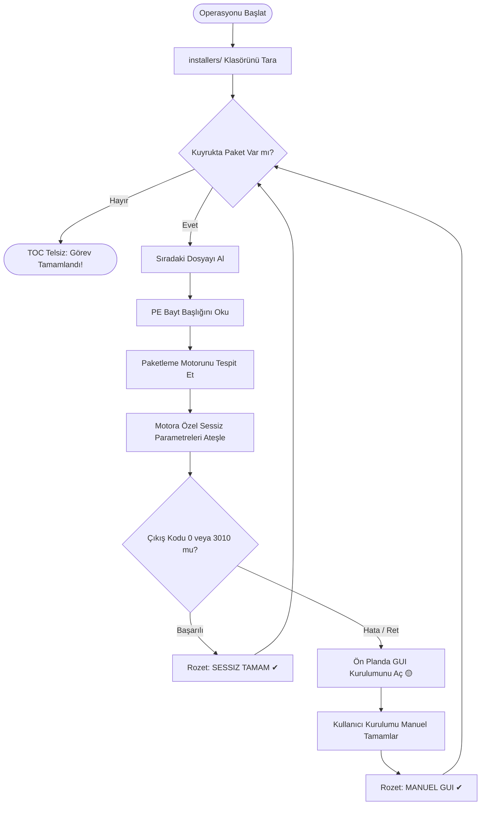

<div align="center">

```
  ___           _        _ _                    _   _       _   
 |_ _|_ __  ___| |_ __ _| | |   ___  _ __      | \ | | ___ | |_ 
  | || '_ \/ __| __/ _` | | |  / _ \| '__|____ |  \| |/ _ \| __|
  | || | | \__ \ || (_| | | | | (_) | | |_____|| |\  | (_) | |_ 
 |___|_| |_|___/\__\__,_|_|_|  \___/|_|        |_| \_|\___/ \__|
```

### Windows İçin Taktik Post-Format & Otomatik Kurulum Süiti
*Ready or Not'un operasyonel atmosferinden ve gerçekçiliğinden ilham alınarak geliştirildi.*

[](https://github.com/Uwedwa/install-or-not)
[](https://www.python.org/)
[](https://github.com/Uwedwa/install-or-not)
[](https://github.com/Uwedwa/install-or-not/releases)
[](LICENSE)

<p align="center">
  <b><a href="README.md">English</a></b> • <b><a href="README_TR.md">Türkçe</a></b>
</p>

```
   ______________________________________________________________________
  /                                                                      \
 |   [TOC] "Giriş timi, komuta merkezi devrede. Emirleriniz bekleniyor."  |
 |   [ENTRY TEAM] "Yüksek zemin emniyete alındı. Taktik cephanelik hazır."|
  \______________________________________________________________________/
```

</div>

---

## 📑 Operasyon Yönergeleri

- [🎯 TOC Görev Brifingi](#-toc-görev-brifingi)
- [⚡ Taktik 2.0 ile Gelen Yenilikler](#-taktik-20-ile-gelen-yenilikler)
- [🧠 PE İkili Balistiği (Akıllı Motor Tespiti)](#-pe-ikili-balistiği-akıllı-motor-tespiti)
- [🎯 Taktik Winget Cephanelik Setleri](#-taktik-winget-cephanelik-setleri)
- [🔄 Standart Operasyon Prosedürü (Akış Şeması)](#-standart-operasyon-prosedürü-akış-şeması)
- [🚀 Dağıtım Operasyonu (2 Farklı Kullanım)](#-dağıtım-operasyonu-2-farklı-kullanım)
  - [🟢 Yöntem 1: Hazır Tek Parça (.exe) ile Çalıştırma (Önerilen)](#-yöntem-1-hazır-tek-parça-exe-ile-çalıştırma-önerilen)
  - [🛠️ Yöntem 2: Kaynak Koddan Çalıştırma (Python)](#️-yöntem-2-kaynak-koddan-çalıştırma-python)
- [📦 Saha İçin Bağımsız (.exe) Derleme](#-saha-için-bağımsız-exe-derleme)
- [📻 TOC Telsiz İletişim Kayıtları](#-toc-telsiz-iletişim-kayıtları)
- [📁 Taktik Mühimmat Mimarisi](#-taktik-mühimmat-mimarisi)
- [🎗️ Brifing Sonu ve Katkıda Bulunanlar](#️-brifing-sonu-ve-katkıda-bulunanlar)

---

## 🎯 TOC Görev Brifingi

Temiz bir Windows formatı sonrası makineyi ayağa kaldırmak; bitmek bilmeyen kurulum sihirbazları, paketlerin içine gizlenmiş gereksiz yazılımlar ve kilitlenen komut satırlarıyla dolu bir mayın tarlasına dönüşmemeli.

**INSTALL OR NOT 2.0**, format sonrası kurulum sürecini yüksek disiplinli bir taktik operasyona dönüştürür:
* **Toplanma Alanı (Staging Zone):** Yüklemek istediğin `.exe` ve `.msi` kurulum dosyalarını `installers/` klasörüne bırak.
* **Derin PE Taraması:** Sıfır bağımlılıklı bayt tarayıcısı dosya başlıklarını analiz ederek paketin **Inno Setup, NSIS, WiX / Burn, InstallShield, 7-Zip SFX, Advanced Installer veya Microsoft Installer (MSI)** altyapılarından hangisiyle hazırlandığını anında tespit eder.
* **Nokta Atışı Sessiz Kurulum:** Motora yabancı gelen hatalı bayraklar yerine yalnızca o motora özel doğrulanmış sessiz kurulum argümanlarını ateşler.
* **Etkileşimli Yedekleme Protokolü (GUI Fallback):** Eğer bir kurulum dosyası sessiz kuruluma direnirse, sistem kurulum penceresini ön planda etkileşimli olarak açar. Kullanıcı adımı tamamladığında operasyon kuyruğu kesintisiz devam eder.
* **Winget Cephaneliği:** Elinde hazır dosya yok mu? **🎯 WINGET ARMORY** sekmesine geçip popüler hazır setleri (Oyun, Yazılım Geliştirici, Günlük Medya) tek tıkla indirip kurabilirsin.

---

## ⚡ Taktik 2.0 ile Gelen Yenilikler

| Operasyonel Yetenek | Eski v1.0 | 🚀 Taktik v2.0 |
| :--- | :--- | :--- |
| **Motor Keşfi** | Yok (Tüm bayrakları körlemesine yollama) | **Sıfır bağımlılıklı PE bayt başlığı analizi** |
| **Sessiz Argümanlar** | Çakışan parametreler (`/S /SILENT /quiet` birlikte) | **Motora özel doğrulanmış parametreler** (Sıfır sözdizimi çökmesi) |
| **Taktik HUD** | Düz metin kutusu | **Modern Siber Karanlık HUD**, anlık durum kartları ve ilerleme çubuğu |
| **Durum Rozetleri** | Düz log çıktısı | **Görsel kart rozetleri (`KUYRUKTA`, `KURULUYOR`, `✔ SESSIZ TAMAM`, `🟡 MANUEL GUI`, `❌ BASARISIZ`)** |
| **Winget Cephaneliği** | Basit komut çalıştırma | **Tek Tıkla Özel Profil Setleri** (Gaming, DevKit, Recon) |
| **Kuyruk Dayanıklılığı** | Hata anında betik donması | **Çok iş parçacıklı kuyruk ve zaman aşımı koruması** |
| **Telsiz / Ses Efektleri** | Sessiz | **Aşamalar arası taktik frekans sesleri (`winsound`)** |
| **Taşınabilirlik** | Python kurulumu zorunlu | **Bağımsız tek dosya çalıştırılabilir sürüm (`Install_or_Not.exe`)** |

---

## 🧠 PE İkili Balistiği (Akıllı Motor Tespiti)

Farklı altyapılarla üretilmiş yükleyiciler, tanımadıkları komut satırı bayrakları verildiğinde hata verip kapanır. **Install or Not 2.0**, dosyanın ilk 512 KB ve son 64 KB bayt aralığını tarayarak kesin teşhis koyar:

| Paketleme Motoru | İkili İmza / Bayt Deseni | Gönderilen Sessiz Kurulum Parametreleri |
| :--- | :--- | :--- |
| **Inno Setup** | `Inno Setup Setup Data`, `InnoSetup` | `/VERYSILENT /NORESTART /SUPPRESSMSGBOXES /SP-` |
| **NSIS (Nullsoft)** | `NullsoftInst`, `Nullsoft.NSIS` | `/S` *(Büyük harf duyarlı)* |
| **WiX / Burn** | `WixBurn`, `WixAttachedContainer` | `/quiet /norestart` |
| **InstallShield** | `InstallShield`, `ISSetup.dll` | `/s /v"/qn /norestart"` |
| **7-Zip SFX** | `7z\xbc\xaf\x27\x1c`, `7zS.sfx` | `-y` |
| **Advanced Installer** | `Advanced Installer`, `Caphyon` | `/exenoui /qn /norestart` |
| **MSI Paketi** | Microsoft Windows Installer Bileşeni | `msiexec /i <dosya> /qn /norestart /passive` |
| **Genel / Bilinmeyen** | Tanımlanamayan PE | Güvenli aşamalı yoklama ➔ Otomatik Manuel Arayüz (GUI) |

---

## 🎯 Taktik Winget Cephanelik Setleri

Yerel kurulum dosyasına sahip olmadığında doğrudan **🎯 WINGET ARMORY** sekmesine geçip hazır operasyonel paketleri tek tıkla kurabilirsin:

```
├── 🎮 Gaming Vanguard
│   ├── Valve Steam
│   ├── Discord
│   ├── OBS Studio
│   ├── 7-Zip
│   ├── Visual C++ 2015-2022 All-in-One
│   └── DirectX End-User Runtime
│
├── 💻 Operator DevKit
│   ├── Git for Windows
│   ├── Microsoft Visual Studio Code
│   ├── Windows Terminal
│   ├── Python 3.12
│   ├── Node.js LTS
│   └── Docker Desktop
│
└── 🌐 Recon & Günlük Operasyonlar
    ├── Brave Browser
    ├── VLC Media Player
    ├── Spotify
    ├── ShareX
    ├── qBittorrent
    └── Notepad++
```

---

## 🔄 Standart Operasyon Prosedürü (Akış Şeması)



---

## 🚀 Dağıtım Operasyonu (2 Farklı Kullanım)

### 🟢 Yöntem 1: Hazır Tek Parça (.exe) ile Çalıştırma (Önerilen)

> **Sıfır Bağımlılık:** Sistemde Python veya herhangi bir ek paket kurulu olması gerekmez. Format sonrası kullanım ve USB bellekler için idealdir.

1. **İndirin:** [**GitHub Releases**](https://github.com/Uwedwa/install-or-not/releases) sekmesinden en güncel `Install_or_Not.exe` dosyasını temin edin.
2. **Staging Alanı:** `Install_or_Not.exe` dosyasının bulunduğu dizinde `installers` adında bir klasör oluşturun:
   ```cmd
   mkdir installers
   ```
3. **Mühimmatı Yükleyin:** Kurmak istediğin tüm `.exe` ve `.msi` kurulum dosyalarını `installers/` klasörünün içine sürükleyip bırakın.
4. **Çalıştırın:** `Install_or_Not.exe` dosyasına sağ tıklayıp **Yönetici olarak çalıştır** seçeneğini seçin.
5. **Operasyonu Başlatın:** Taktik arayüz üzerinden **Engage Deployment** butonuna basın ve kurulumu takip edin.

---

### 🛠️ Yöntem 2: Kaynak Koddan Çalıştırma (Python)

> **Geliştiriciler İçin:** Kod üzerinde değişiklik yapmak, yeni motor imzaları eklemek veya terminal üzerinden çalıştırmak isteyenler için.

#### Ön Koşullar
- **Windows 10 / 11**
- **Python 3.10+**
- Yönetici (Administrator) yetkileri

#### Hızlı Başlangıç

```powershell
# 1. Depoyu klonlayın ve klasöre girin
git clone https://github.com/Uwedwa/install-or-not.git
cd install-or-not

# 2. Arayüz bağımlılıklarını yükleyin (Pillow)
pip install -r requirements.txt

# 3. installers klasörünü oluşturun
mkdir installers

# 4. Taktik HUD arayüzünü başlatın
python install_or_not.py
```

---

## 📦 Saha İçin Bağımsız (.exe) Derleme

Kendi tek parça taşınabilir `.exe` dosyanızı derlemek isterseniz:

```powershell
# 1. Gerekli araçları yükleyin
pip install pyinstaller pillow

# 2. Tek dosya, pencere modunda derleyin
python -m PyInstaller --noconfirm --onefile --windowed `
  --name "Install_or_Not" `
  --collect-all core `
  install_or_not.py
```

Derlenen dosya `dist/Install_or_Not.exe` altında hazır olacaktır.

---

## 📻 TOC Telsiz İletişim Kayıtları

Entegre **TOC Communications HUD**, operasyon anında canlı telsiz bildirimleri sunar:

* 🟢 `[SUCCESS]` *"Entry team to TOC, mission complete. All targets secured."*
* 🟢 `[SUCCESS]` *"High ground secured. All software deployed without casualties."*
* 🟡 `[WARNING]` *"Silent deployment exited with non-zero code. Initiating interactive GUI fallback..."*
* 🔴 `[CRITICAL]` *"Hostiles encountered during package deployment! Error reported."*

---

## 📁 Taktik Mühimmat Mimarisi

```
install-or-not/
├── install_or_not.py          # Taktik HUD Arayüzü & Operasyon Yöneticisi
├── core/
│   ├── __init__.py            # Çekirdek modül başlatıcısı
│   ├── detector.py            # Sıfır bağımlılıklı PE başlık analiz motoru
│   ├── executor.py            # Çok iş parçacıklı kuyruk ve GUI yedekleme motoru
│   └── presets.py             # Winget cephanelik setleri ve profil yönetimi
├── installers/                # Kurulum paketlerinin toplanma alanı
├── requirements.txt           # Asgari çalışma zamanı gereksinimleri (Pillow)
├── LICENSE                    # GNU Genel Kamu Lisansı v3.0
├── README.md                  # Taktik Saha El Kitabı (İngilizce)
└── README_TR.md               # Taktik Saha El Kitabı (Türkçe)
```

---

## 🎗️ Brifing Sonu ve Katkıda Bulunanlar

* **Operatör:** **[uwedwa](https://github.com/Uwedwa)** tarafından geliştirildi.
* **Atmosfer:** *Ready or Not* (VOID Interactive) oyununun taktiksel gerçekçiliğinden esinlenilmiştir.
* **Lisans:** Bu proje **GNU General Public License v3.0** lisansı ile korunmaktadır. Ayrıntılar için [LICENSE](LICENSE) dosyasına göz atabilirsiniz.

<div align="center">
  <sub>Python, kafein ve operasyonel disiplinle üretildi. Talk to me, TOC!</sub>
</div>
