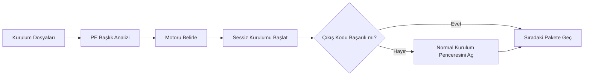

# Install or Not

> Windows için otomatik yazılım dağıtım ve format sonrası kurulum aracı.

[](https://github.com/Uwedwa/install-or-not)
[](https://www.python.org/)
[](LICENSE)
[](https://github.com/Uwedwa/install-or-not/releases)

<p align="left">
  <b><a href="README.md">English</a></b> • <b><a href="README_TR.md">Türkçe</a></b>
</p>

---

## Genel Bakış

**Install or Not**, bilgisayara format atıldıktan veya yeni bir Windows sistemi kurulduktan sonra gerekli yazılımların kurulum sürecini otomatikleştiren pratik bir dağıtım aracıdır.

Kurulum sihirbazlarında sürekli "İleri" butonlarına tıklamak veya her programın sessiz kurulum parametrelerini ayrı ayrı aramak yerine; **Install or Not**, `.exe` ve `.msi` dosyalarının PE (Portable Executable) başlıklarını bayt seviyesinde inceler, paketleme motorunu tespit eder ve uygun sessiz kurulum argümanlarıyla otomatik olarak çalıştırır.

Eğer bir yazılım sessiz kuruluma izin vermezse veya hata verirse, uygulama kurulum penceresini ön planda normal bir şekilde açar. Böylece kurulumu elle tamamlayabilir ve kuyrukta bekleyen diğer programların aksamadan devam etmesini sağlayabilirsiniz.

---

## Öne Çıkan Özellikler

- **Akıllı Motor Tespiti:** Ek bir bağımlılık olmadan Inno Setup, NSIS, WiX / Burn, InstallShield, 7-Zip SFX, Advanced Installer ve MSI altyapılarını ikili başlık imzalarından tanır.
- **Doğru Sessiz Parametreler:** Her motora yalnızca desteklediği bayrakları iletir (örneğin Inno için `/VERYSILENT`, NSIS için `/S`, WiX için `/quiet`), hatalı parametre kaynaklı çökmeleri önler.
- **Etkileşimli Arayüz Desteği (Fallback):** Sessiz kurulumun başarısız olduğu durumlarda kurulum penceresini ön planda açarak manuel tamamlamaya olanak tanır.
- **Winget Entegrasyonu:** Yerel dosyanız olmadığında Geliştirici Araçları, Üretkenlik ve Medya gibi popüler yazılım setlerini Windows Paket Yöneticisi üzerinden tek tıkla kurabilir.
- **Modern Kullanıcı Arayüzü:** Koyu tema, anlık durum rozetleri (`KUYRUKTA`, `YÜKLENİYOR`, `TAMAMLANDI`, `MANUEL`), ilerleme çubuğu ve canlı terminal çıktısı.
- **Taşınabilir Tek Dosya (.exe):** Sistemde Python veya harici kütüphane kurulu olmasına gerek kalmadan tek parça `.exe` olarak çalışabilir.

---

## Desteklenen Kurulum Motorları

| Motor | İmza / Bayt Deseni | Sessiz Parametreler |
| :--- | :--- | :--- |
| **Inno Setup** | `Inno Setup Setup Data`, `InnoSetup` | `/VERYSILENT /NORESTART /SUPPRESSMSGBOXES /SP-` |
| **NSIS (Nullsoft)** | `NullsoftInst`, `Nullsoft.NSIS` | `/S` |
| **WiX / Burn** | `WixBurn`, `WixAttachedContainer` | `/quiet /norestart` |
| **InstallShield** | `InstallShield`, `ISSetup.dll` | `/s /v"/qn /norestart"` |
| **7-Zip SFX** | `7z\xbc\xaf\x27\x1c`, `7zS.sfx` | `-y` |
| **Advanced Installer** | `Advanced Installer`, `Caphyon` | `/exenoui /qn /norestart` |
| **Microsoft MSI** | OLE / Bileşik Belge Başlığı | `msiexec /i <dosya> /qn /norestart /passive` |
| **Genel / Bilinmeyen** | Tanımlanamayan PE | Güvenli deneme → Otomatik Etkileşimli Kurulum |

---

## Çalışma Mantığı



---

## Kurulum ve Kullanım

### Yöntem 1: Hazır Tek Parça (.exe) ile Çalıştırma (Önerilen)

> Python veya ek bağımlılık gerektirmez.

1. [**Releases**](https://github.com/Uwedwa/install-or-not/releases) sayfasından en güncel **`Install_or_Not.exe`** dosyasını indirin.
2. Dosyayı kendine ait bir klasörün içine koyun (örneğin Masaüstünüzde veya USB belleğinizde bir klasöre).
3. `Install_or_Not.exe` dosyasına sağ tıklayıp **Yönetici olarak çalıştırın**.
   * *Program ilk açılışta yanına `installers/` klasörünü otomatik olarak oluşturacaktır.*
4. Kurmak istediğiniz `.exe` ve `.msi` dosyalarını oluşan bu `installers/` klasörüne atın.
5. Arayüzdeki **Scan / Refresh** butonuna basarak dosyaları listeleyin, ardından **Start Installation** ile kurulumu başlatın.

*(İsteğe bağlı: Yerel dosyanız yoksa **Winget Armory** sekmesine geçerek popüler program paketlerini internet üzerinden tek tıkla kurabilirsiniz.)*

---

### Yöntem 2: Kaynak Koddan Çalıştırma (Python)

Windows 10/11 üzerinde **Python 3.10+** gerektirir.

```powershell
# 1. Depoyu klonlayın
git clone https://github.com/Uwedwa/install-or-not.git
cd install-or-not

# 2. Bağımlılıkları yükleyin
pip install -r requirements.txt

# 3. Uygulamayı başlatın
python install_or_not.py
```

---

## Kaynak Koddan (.exe) Derleme

Kendi bağımsız çalıştırılabilir dosyanızı derlemek için:

```powershell
pip install pyinstaller pillow
python -m PyInstaller --noconfirm --onefile --windowed `
  --name "Install_or_Not" `
  --collect-all core `
  install_or_not.py
```

Derlenen dosya `dist/Install_or_Not.exe` dizininde hazır olacaktır.

---

## Proje Yapısı

```
install-or-not/
├── install_or_not.py    # Ana kullanıcı arayüzü
├── core/
│   ├── __init__.py      # Çekirdek modül tanımı
│   ├── detector.py      # PE ikili başlık motoru
│   ├── executor.py      # Çok iş parçacıklı kuyruk ve fallback motoru
│   └── presets.py       # Winget hazır paketleri
├── installers/          # Kurulum dosyaları klasörü (otomatik oluşturulur)
├── requirements.txt     # Python bağımlılıkları (Pillow)
├── LICENSE              # GPL-3.0 lisansı
├── README.md            # İngilizce dokümantasyon
└── README_TR.md         # Türkçe dokümantasyon
```

---

## Lisans

Bu proje [GNU General Public License v3.0](LICENSE) ile lisanslanmıştır.
